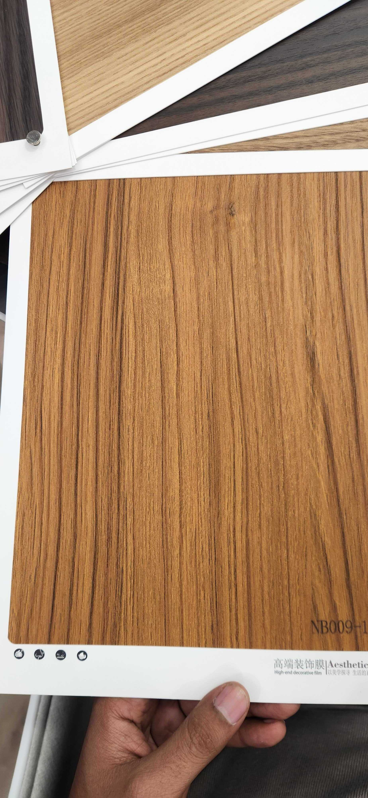

# Aesthetic NB009+ — Teak (Rift Cut)

**7.5 / 10 — Strong Contender** · Target: Teak (*Tectona grandis*) · Cut: Rift / quarter cut · 2026-04-12

---

## Identity
| | |
|---|---|
| Brand | Aesthetic (高端装饰膜 — High-end decorative film) |
| Product Code | NB009+ |
| Target Species | Teak (*Tectona grandis*) |
| Cut Simulated | Rift / quarter cut — straight parallel grain |
| Finish | Satin (~15–20% sheen) — slightly high |
| Pattern Repeat | ~2.0–2.8 m (est.) — straight grain hides repeat well |

---

## Score Breakdown
| | Score | Weight | Contribution |
|---|---|---|---|
| Species Demand (India) | 8.8 / 10 | 40% | 3.52 |
| Mimicry Quality | 6.7 / 10 | 60% | 4.02 |
| **Film Score** | **7.5 / 10** | | |

> Rift cut is a smarter choice than flat cut for teak film — no cathedral arch to fail at. Straight grain hides repeat and reads confidently at distance.

---

## Mimicry Quality — 6.7 / 10

| Dimension | Weight | Score | Note |
|---|---|---|---|
| Tone Accuracy | 15% | 7.0 | Warm golden-amber — correct teak register |
| Grain Pattern | 20% | 7.5 | Straight rift grain — clean, convincing, no complexity to fail |
| Tonal Variation | 15% | 7.0 | Darker brown streaks against amber base — naturalistic |
| Heartwood-Sapwood | 10% | 5.5 | Absent — structural gap shared by all teak films in catalog |
| Pore / EIR Texture | 15% | 6.0 | Some texture present; EIR alignment to grain unconfirmed |
| Finish Level | 15% | 6.0 | ~15–20% — one step too high; 8–12% satin unlocks premium channel |
| Depth Illusion | 10% | 6.5 | Adequate — tonal gradient does moderate work |

**Key advantage over WiseWood Teak Flat Cut:** Rift grain avoids the cathedral arch execution trap entirely. Pattern repeat is longer and more consistent. Scores 0.3 points higher on mimicry (6.7 vs 6.4).

---

## India Market Fit

**Peak segments:** Heritage Buyers · Aspirational Professionals · Tier-2 Aspirants

**Best cities:** Chennai · Ahmedabad · Delhi NCR · Hyderabad · All Tier-2

| Application | Fit | Application | Fit |
|---|---|---|---|
| TV / Media Wall | ✓✓ | Wardrobe Shutters | ✓✓ |
| Bedroom Headboard | ✓✓ | Kitchen Cabinets | ✓ |
| Home Office | ✓ | Pooja Unit | ✓ |
| Foyer / Entryway | ✓ | Dining Accent | ✓ |

| Design Style | Alignment |
|---|---|
| Contemporary Indian | Strong |
| Neo-Classical / Transitional | Strong |
| Heritage / Traditional | Strong |
| Biophilic / Natural | Moderate |
| Japandi | Weak |

---

## Gap to Top 3 (8.5 threshold)
**Gap: 1.0 points.** Same demand advantage as WiseWood teak (8.8) — bottleneck is mimicry (6.7 → needs 7.5+).

Priority improvements:
1. **Finish reduction** — 15–20% → 8–12% satin; single highest-impact change
2. **Heartwood-sapwood contrast** — cream-pale band at one panel edge
3. **EIR upgrade** — confirm pore channels register to grain lines under raking light

---

## Verdict

**Sell here:** Broadest application in catalog — Heritage buyers and aspirational professionals across all cities. Particularly strong in Chennai, Ahmedabad, Delhi NCR, all Tier-2.

**Don't use for:** Japandi briefs, strict open-pore matte specifications, maximalist dark interiors.

**Priority fix:** Reduce finish to 8–12% satin. The grain execution is solid — the finish is the only thing holding this out of the premium specification channel.

**Core insight:** The rift cut decision is commercially smart. Straight grain is harder to dismiss as film at a glance, ages better in long installations, and hides the pattern repeat on large walls. This is a more versatile teak film than the flat-cut WiseWood, and with a finish correction it edges ahead commercially.
