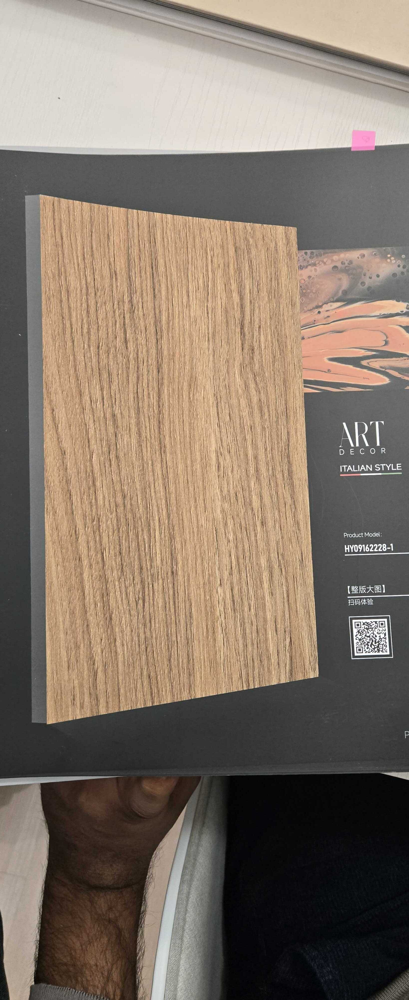

# ART DECOR HY09162228-1 — European Oak

**7.5 / 10 — Strong Contender** · Target: European Oak (*Quercus robur*) · Cut: Rift cut (straight parallel grain, no cathedral) · 2026-04-12

---

## Identity
| | |
|---|---|
| Brand | ART DECOR Italian Style |
| Product Code | HY09162228-1 |
| Target Species | European / White Oak — rift cut |
| Finish | Open-pore matte to low satin (~5–12% sheen) — **best in batch** |
| Pattern Repeat | ~1.8–2.5 m (est.) — straight grain hides repeat well |

---

## Score Breakdown
| | Score | Weight | Contribution |
|---|---|---|---|
| Species Demand (India) | 7.2 / 10 | 40% | 2.88 |
| Mimicry Quality | 7.1 / 10 | 60% | 4.26 |
| Japandi trend premium | — | — | +0.36 |
| **Film Score** | **7.5 / 10** | | |

> **Highest mimicry quality of all films analyzed.** Score held back only by oak's lower demand ceiling vs. walnut.

---

## Mimicry Quality — 7.1 / 10

| Dimension | Weight | Score | Note |
|---|---|---|---|
| Tone Accuracy | 15% | 7.5 | Near-perfect warm honey-blonde — **best tone in batch** |
| Grain Pattern | 20% | 7.5 | Straight rift grain — well-executed; avoids cathedral arch complexity |
| Tonal Variation | 15% | 6.5 | Subtle and naturalistic — correct level of drama for rift oak |
| Heartwood-Sapwood | 10% | 6.5 | Heartwood-only — less critical for oak than walnut |
| Pore / EIR Texture | 15% | 6.5 | Ring-porous texture weight present; EIR registration unconfirmed |
| Finish Level | 15% | 8.0 | Open-pore matte — **the only finish that works for Japandi oak** |
| Depth Illusion | 10% | 6.5 | Above average; matte finish does the heavy lifting |

---

## India Market Fit

**Peak segment:** Design-forward millennials (25–35, Bengaluru/Pune) — oak IS Japandi.

**Best cities:** Bengaluru · Pune · Mumbai · Hyderabad

| Application | Fit | Application | Fit |
|---|---|---|---|
| Bedroom Headboard | ✓✓ | TV / Media Wall | ✓ |
| Kitchen Cabinet Shutters | ✓✓ | Wardrobe Shutters | ✓ |
| Home Office / Study | ✓✓ | Foyer / Entryway | ✓ |
| Dining Accent Wall | ✓ | Pooja Unit | ✗ |

| Design Style | Alignment |
|---|---|
| Japandi | **Very Strong** |
| Biophilic / Natural | **Very Strong** |
| Contemporary Indian | Strong |
| Neo-Classical | Weak |
| Industrial Chic | Weak |

---

## Gap to Top 3 (8.5 threshold)
**Gap: 1.0 points.** Unlike walnut, this gap is mostly a demand ceiling — oak's India demand (7.2) needs to grow to 8.5+ to pull the Film Score up. Trajectory is positive; oak demand grows with Japandi trend.

Execution improvements that help:
1. EIR audit — confirm pore channels register to grain lines; upgrade if not
2. Slightly cool the tone (reduce warm-yellow 5–8%) for stricter Japandi specifications

---

## Verdict

**Sell here:** Design-forward millennial interiors in Bengaluru and Pune. Premium kitchen showrooms. Japandi and biophilic residential briefs. Boutique hospitality.

**Don't use for:** Heritage buyers, Tier-2 volume applications, pooja units, any warm-wood brief (wrong tone register entirely).

**Key sales argument:** "European oak visual quality with full tropical climate stability. No monsoon movement, no cracking, no delamination. Matte-specification finish that architects will approve without pushback."

**Priority fix:** Conduct raking-light EIR test. If pore emboss doesn't align to grain lines, upgrade the emboss plate. This is the single step that unlocks luxury specification channel acceptance.

**Core insight:** This is the best-executed film of the batch on pure mimicry. Its path to commercial success is not volume but **design-channel penetration** — get it into architect sample kits. One specification in a 50-unit Bengaluru apartment project is worth more than 100 volume sales.
