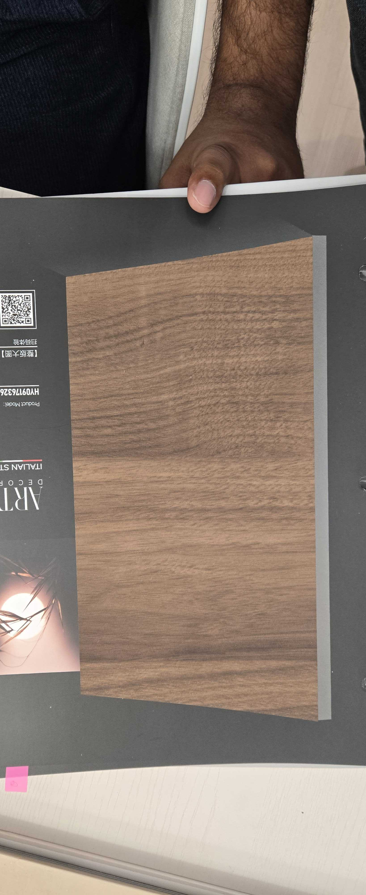

# ART DECOR HY09176326 — Walnut

**7.6 / 10 — Strong Contender** · Target: American/European Walnut (*Juglans nigra / regia*) · Cut: Flat cut (flowing wave figure) · 2026-04-12

---

## Identity
| | |
|---|---|
| Brand | ART DECOR Italian Style |
| Product Code | HY09176326 |
| Target Species | Walnut — reads closer to J. regia (European) than J. nigra (American) |
| Finish | Satin (~10–18% sheen) — correctly specified |
| Pattern Repeat | ~1.2–1.5 m (est.) — short for large-wall use |

---

## Score Breakdown
| | Score | Weight | Contribution |
|---|---|---|---|
| Species Demand (India) | 8.2 / 10 | 40% | 3.28 |
| Mimicry Quality | 6.3 / 10 | 60% | 3.78 |
| Walnut growth trajectory bonus | — | — | +0.54 |
| **Film Score** | **7.6 / 10** | | |

> Walnut is India's fastest-growing premium species. Even a 6.3 mimicry score produces a 7.6 Film Score. **The species choice is the biggest lever here.**

---

## Mimicry Quality — 6.3 / 10

| Dimension | Weight | Score | Note |
|---|---|---|---|
| Tone Accuracy | 15% | 6.5 | Warm-brown correct; lighter than J. nigra, closer to J. regia |
| Grain Pattern | 20% | 6.5 | Flowing wave figure convincing; correct for flat-cut walnut |
| Tonal Variation | 15% | 6.5 | Good cloud-gradient; naturalistic |
| Heartwood-Sapwood | 10% | 5.5 | Heartwood-only — misses walnut's most dramatic feature |
| Pore / EIR Texture | 15% | 6.0 | Fine emboss; adequate for diffuse-porous species |
| Finish Level | 15% | 7.0 | Satin — **correctly specified** |
| Depth Illusion | 10% | 6.0 | Above average; tonal gradient helps |

---

## India Market Fit

**Peak segment:** Aspirational professionals (30–45, Mumbai/Bengaluru/Pune) — walnut is *their* species.

**Best cities:** Mumbai · Bengaluru · Pune · Hyderabad

| Application | Fit | Application | Fit |
|---|---|---|---|
| TV / Media Wall | ✓✓ | Wardrobe Shutters | ✓ |
| Bedroom Headboard | ✓✓ | Kitchen Cabinets | ~ |
| Home Office / Study | ✓✓ | Dining Accent Wall | ✓ |
| Foyer / Entryway | ✓ | Pooja Unit | ✗ |

| Design Style | Alignment |
|---|---|
| Contemporary Indian | Strong |
| Japandi | Strong |
| Biophilic / Natural | Moderate |
| Neo-Classical | Moderate |
| Industrial Chic | Moderate |

---

## Gap to Top 3 (8.5 threshold)
**Gap: 0.9 points.** Closable with:
1. Deepen and cool the tone toward J. nigra (grey-chocolate vs. warm-brown)
2. Add an open-pore matte variant (3–6% sheen) — unlocks architect specification channel
3. Extend pattern repeat to 2.5–3.0 m for large-format walls

---

## Verdict

**Sell here:** TV walls and wardrobes for aspirational professionals in Mumbai, Bengaluru, Pune. Premium residential interiors in Hyderabad and Delhi NCR.

**Don't use for:** Heritage buyers (they want teak/rosewood by name), Tier-2 volume carpentry (better value options exist), pooja units.

**Priority fix #1:** Develop an open-pore matte variant (3–6%). This single change opens the entire design-specification channel.

**Priority fix #2:** Deepen and cool the tone by 20% toward American walnut (grey-chocolate). Unlocks the growing J. nigra demand in premium urban.

**Core insight:** This film chose the right species. Walnut demand in India is so strong that a 6.3 mimicry score still delivers a 7.6 Film Score. Improve the mimicry and this is the first film that could break 8.5.
