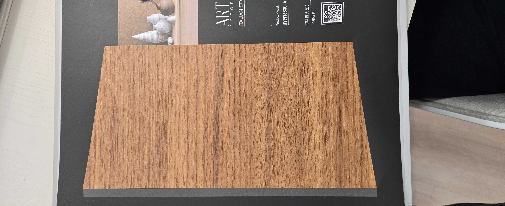

# ART DECOR HY9T76330-4 — Iroko / Tropical Hardwood

**6.1 / 10 — Niche** · Target: Iroko (*Milicia excelsa*) · Cut: Quarter/Straight grain · 2026-04-12

---

## Identity
| | |
|---|---|
| Brand | ART DECOR Italian Style |
| Product Code | HY9T76330-4 |
| Target Species | Iroko / Tropical Warm Hardwood |
| Finish | Semi-gloss (~20–30% sheen) — too high |
| Pattern Repeat | ~1.5–2.0 m (est.) |

---

## Score Breakdown
| | Score | Weight | Contribution |
|---|---|---|---|
| Species Demand (India) | 5.8 / 10 | 40% | 2.32 |
| Mimicry Quality | 6.0 / 10 | 60% | 3.60 |
| Warm-wood India bias | — | — | +0.18 |
| **Film Score** | **6.1 / 10** | | |

---

## Mimicry Quality — 6.0 / 10

| Dimension | Weight | Score | Note |
|---|---|---|---|
| Tone Accuracy | 15% | 6.0 | Orange-amber correct direction; 10–15% oversaturated |
| Grain Pattern | 20% | 7.0 | **Strongest attribute** — clean, straight, well-varied |
| Tonal Variation | 15% | 6.0 | Present; transitions slightly mechanical |
| Heartwood-Sapwood | 10% | 6.5 | Heartwood-only — commercially appropriate |
| Pore / EIR Texture | 15% | 5.5 | Generic emboss; ring-porous character not captured |
| Finish Level | 15% | 5.5 | Semi-gloss kills premium positioning |
| Depth Illusion | 10% | 5.0 | Standard flat film |

---

## India Market Fit

**Best segments:** Tier-2 aspirants · Aspirational professionals (warm-wood buyers)

**Best cities:** Ahmedabad · Chennai · Delhi NCR · Hyderabad · Tier-2

| Application | Fit | Application | Fit |
|---|---|---|---|
| TV / Media Wall | ✓ | Kitchen Cabinets | ~ |
| Bedroom Headboard | ✓ | Foyer / Entryway | ~ |
| Wardrobe Shutters | ✓ | Pooja Unit | ✗ |
| Dining Accent Wall | ✓ | Home Office | ✓ |

| Design Style | Alignment |
|---|---|
| Contemporary Indian | Moderate |
| Neo-Classical / Transitional | Moderate |
| Biophilic / Natural | Moderate |
| Japandi | Weak |
| Maximalist Luxury | Weak |

---

## Verdict

**Sell here:** Tier-2 city carpentry, Ahmedabad/Chennai/Hyderabad mid-market residential, volume warm-wood applications.

**Don't use for:** Mumbai/Bengaluru premium residential, designer-specification briefs, any brief where a teak film is already in consideration.

**Priority fix:** Reformulate topcoat to satin (10–15%). Minimal cost, unlocks the premium channel. Estimated score impact: +0.5.

**Core problem:** Iroko has no brand pull in India. This film must win on warm-colour appeal alone — which puts it in direct competition with teak films that carry a stronger name. Price this 15–25% below teak-film alternatives to compensate.
