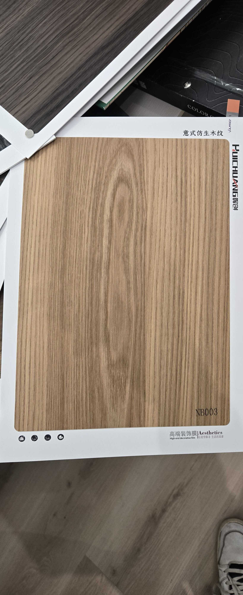

# Huichuang NB003 — European Oak (Flat Cut)

**7.5 / 10 — Strong Contender** · Target: European Oak (*Quercus robur*) · Cut: Flat cut (subtle cathedral arch) · 2026-04-12

---

## Identity
| | |
|---|---|
| Brand | Huichuang (惠创) / Aesthetics |
| Product Code | NB003 |
| Label | 意式仿生木纹 — Italian-style bionic wood grain |
| Target Species | European Oak (*Quercus robur*) |
| Cut Simulated | Flat cut — fine straight grain with subtle central cathedral arch |
| Finish | Open-pore matte (~6–10% sheen) — best calibrated oak finish in catalog |
| Pattern Repeat | ~1.5–2.0 m (est.) — cathedral arch limits very large panels |

---

## Score Breakdown
| | Score | Weight | Contribution |
|---|---|---|---|
| Species Demand (India) | 7.2 / 10 | 40% | 2.88 |
| Mimicry Quality | 7.2 / 10 | 60% | 4.32 |
| Japandi trend premium | — | — | +0.25 |
| **Film Score** | **7.5 / 10** | | |

> Highest mimicry score among oak films. Flat cut reduces Japandi premium vs rift cut — but broadens appeal across Contemporary Indian and transitional briefs.

---

## Mimicry Quality — 7.2 / 10

| Dimension | Weight | Score | Note |
|---|---|---|---|
| Tone Accuracy | 15% | 7.5 | Honey-blonde precisely on target for European oak |
| Grain Pattern | 20% | 7.5 | Fine straight grain with clean, proportionate cathedral arch |
| Tonal Variation | 15% | 7.0 | Lighter cathedral zone against slightly richer surrounding grain |
| Heartwood-Sapwood | 10% | 6.0 | Less critical for oak — mild transition present |
| Pore / EIR Texture | 15% | 6.5 | Matte finish implies open-pore treatment; alignment unconfirmed |
| Finish Level | 15% | 8.0 | 6–10% open-pore matte — correctly specified, no correction needed |
| Depth Illusion | 10% | 7.0 | Cathedral figure adds natural depth dimension |

**vs ART DECOR Oak:** Higher tone and grain scores (+0.1 mimicry overall). ART DECOR Oak is rift cut — better for strict Japandi. NB003 flat cut is better for Contemporary Indian and wider volume briefs.

---

## India Market Fit

**Peak segments:** Design Millennials · Aspirational Professionals · Contemporary Indian buyers

**Best cities:** Bengaluru · Pune · Mumbai · Hyderabad

| Application | Fit | Application | Fit |
|---|---|---|---|
| Bedroom Headboard | ✓✓ | TV / Media Wall | ✓✓ |
| Kitchen Cabinet Shutters | ✓✓ | Home Office / Study | ✓✓ |
| Wardrobe Shutters | ✓ | Foyer / Entryway | ✓ |
| Dining Accent Wall | ✓ | Pooja Unit | ✗ |

| Design Style | Alignment |
|---|---|
| Contemporary Indian | Strong |
| Biophilic / Natural | Strong |
| Japandi | Moderate (rift cut more authentic for strict briefs) |
| Neo-Classical | Weak |

---

## Gap to Top 3 (8.5 threshold)
**Gap: 1.0 points.** Same as ART DECOR Oak — bottleneck is demand ceiling (7.2), not mimicry. Trajectory positive with Japandi trend growth.

Priority improvements:
1. **EIR audit** — confirm open-pore emboss aligns to grain lines under raking light
2. **Rift-cut variant** — a rift version of this film would score 7.8+ (demand stays same, Japandi premium rises to +0.36, mimicry holds)

---

## Verdict

**Sell here:** Contemporary Indian residential — bedrooms, kitchens, home offices in Bengaluru, Pune, Mumbai. Broader application range than ART DECOR Oak due to flat cut's neutral appeal.

**Don't use for:** Strict Japandi specifications (rift cut preferred), heritage buyers, pooja units, Tier-2 volume.

**Priority fix:** Confirm EIR registration. The finish is already correct — this film needs no reformulation, only verification.

**Core insight:** Best finish calibration of any oak film evaluated. The matte 6–10% is already where most competitors need to go. Sell this where oak is requested without a strict rift-cut specification — it covers 80% of oak briefs.
