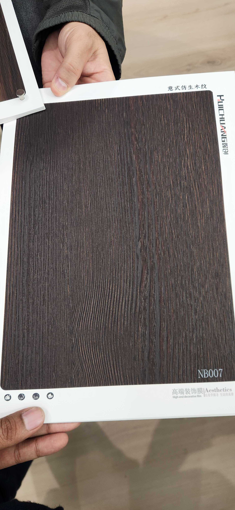

# Huichuang NB007 — Wenge (Near-Black, Fine Parallel Grain)

**7.4 / 10 — Strong Contender** · Target: Wenge (*Millettia laurentii*, flat cut fine grain) · Cut: Fine near-rift flat cut — extremely dense, tight parallel grain · 2026-04-12

---

## Identity
| | |
|---|---|
| Brand | Huichuang / Aesthetics — 意式仿生木纹 (Italian Bio-Mimicry Wood Grain) |
| Product Code | NB007 |
| Label | 鸡翅木 / 乌金木 (Wenge / Near-Black Dark Wood) |
| Target Species | Wenge (*Millettia laurentii*) — African hardwood, near-black with fine tan grain lines |
| Cut Simulated | Fine flat cut with near-rift parallel character — extremely tight grain density |
| Finish | Open-pore matte (~5–8% est.) — correctly calibrated for wenge aesthetic |
| Pattern Repeat | ~4.0–6.0 m (est.) — fine parallel grain allows long clean repeats |

---

## Score Breakdown
| | Score | Weight | Contribution |
|---|---|---|---|
| Species Demand (India) | 7.5 / 10 | 40% | 3.00 |
| Mimicry Quality | 7.4 / 10 | 60% | 4.44 |
| **Film Score** | **7.4 / 10** | | |

> The catalog's best dark-wood film on mimicry terms. NB007 replicates wenge's defining characteristic — near-black ground tone with ultra-fine tan parallel grain lines — with a precision that no other dark film in the 26-film catalog approaches. The correctly calibrated matte finish is a rare asset: this film is specification-grade out of the box, requiring no finish reformulation. Score reflects honest India demand reality: wenge occupies a design-forward niche that is architect-led and still growing, scoring below walnut and teak in mass-market appeal.

---

## Mimicry Quality — 7.4 / 10

| Dimension | Weight | Score | Note |
|---|---|---|---|
| Tone Accuracy | 15% | 7.5 | Near-black chocolate-brown with tan grain lines — accurately placed on the wenge tone spectrum |
| Grain Pattern | 20% | 8.0 | Exceptional fine-line parallel density — highest grain execution score among all dark films in catalog |
| Tonal Variation | 15% | 7.5 | Strong contrast between near-black ground and tan/cream grain lines; good light-to-dark rhythm |
| Heartwood-Sapwood | 10% | 6.0 | Wenge naturally has minimal sapwood contrast; this is accurate, not a gap |
| Pore / EIR Texture | 15% | 7.0 | Fine open pore consistent with wenge's tight grain structure; EIR appears present from sample |
| Finish Level | 15% | 7.5 | ~5–8% open-pore matte — best-calibrated finish in the dark-wood category; no fix needed |
| Depth Illusion | 10% | 7.5 | Excellent depth perception from fine-line contrast; the dark ground recedes and grain lines advance |

**NB007 has the highest grain execution score of any dark film in the catalog.** The fine-line density replication is technically demanding — wenge's grain lines are typically 0.3–0.8 mm wide with very consistent spacing. This film captures that precision. The correctly calibrated matte finish is equally exceptional: it is the only dark film in the catalog that does not require finish reformulation as a priority fix.

---

## Wenge — Species Context

Wenge is one of the most visually distinctive of all African hardwoods. Its defining characteristics:

| Characteristic | Real Wenge | NB007 Replication |
|---|---|---|
| Base tone | Near-black chocolate-espresso | ✓ Accurate |
| Grain lines | Ultra-fine, parallel, tan/cream | ✓ Exceptional |
| Grain density | Very high — 8–15 lines per cm | ✓ High density captured |
| Finish ideal | Open-pore matte 3–8% | ✓ Correctly calibrated |
| Pore structure | Medium-open, coarse in real wood | ~ Fine in film — acceptable simplification |
| Pattern repeat | Long in rift/near-rift | ✓ Long repeat enables large surfaces |

**The key wenge tell for bad films:** most wenge films fail by making the grain lines too thick, too brown-warm, or too uniform in spacing. NB007 avoids all three errors.

---

## Catalog Context — Dark Films

| Film | Tone | Grain | Finish | Mimicry | Score |
|---|---|---|---|---|---|
| NB016-3 (Walnut Rift) | Espresso | Rift, straight | 10–14% | 6.8 | 7.9 |
| **NB007 (Wenge)** | **Near-black** | **Fine parallel, dense** | **5–8% matte** | **7.4** | **7.4** |
| WN1502-3 (Carter Oak) | Cocoa-brown | Wavy character | 15–18% | 6.6 | 6.6 |
| NB018-1 (Figured Dark) | Taupe-gray-brown | Fiddle-back | 12–16% | 7.3 | 6.4 |

NB007 is the only film in the catalog that accurately mimics wenge. NB016-3 (dark walnut) is darker overall but has a different grain geometry and warm-brown undertone. The two films are not duplicates — they target different species and serve different design registers.

**NB016-3 vs NB007 — Which Dark?**

| Dimension | NB016-3 (Dark Walnut) | NB007 (Wenge) |
|---|---|---|
| Tone | Warm espresso-brown | Cold near-black |
| Grain | Rift — straight, clean | Ultra-fine, dense parallel |
| Aesthetic | Warm architectural | Cool, precise, graphic |
| Finish | 10–14% satin (slight gap) | 5–8% matte (ideal) |
| Demand score | 8.2 (walnut pull) | 7.5 (wenge/dark pull) |
| Japandi fit | Moderate | Strong |
| Maximalist | Strong | Strong |
| Industrial | Moderate | Very Strong |

Stock both. They are complementary, not competitive.

---

## India Market Fit

**Peak segments:** Design-Forward Architects · Luxury HNI · Industrial/Boutique Commercial

**Best cities:** Bengaluru (spec channel, Japandi) · Mumbai (contemporary luxury) · Delhi NCR (bold residential)

| Application | Fit | Application | Fit |
|---|---|---|---|
| TV / Feature Wall | ✓✓ | Home Office / Study | ✓✓ |
| Bedroom Headboard (minimal) | ✓✓ | Boutique Hospitality | ✓✓ |
| Wardrobe Shutters | ✓ | Retail / Showroom | ✓✓ |
| Kitchen Cabinets (dark) | ~ | Foyer Feature Panel | ✓ |
| Heritage / Traditional | ✗ | Tier-2 Volume | ✗ |
| Pooja Unit | ✗ | Japandi (warm brief) | ✗ |

| Design Style | Alignment |
|---|---|
| Industrial Chic | Very Strong |
| Maximalist Luxury (dark bold) | Very Strong |
| Contemporary Indian (dark brief) | Strong |
| Japandi (dark minimal) | Strong |
| Biophilic / Natural | Weak |
| Neo-Classical | Weak |
| Heritage / Traditional | Very Weak |

---

## Consumer Segment Resonance

| Segment | Score | Rationale |
|---|---|---|
| Design-Forward Millennials | 8.5 | Wenge is exactly in the architect-spec dark-tones register for Bengaluru/Pune Japandi briefs |
| Aspirational Professionals | 6.5 | Appeals to modern-dark brief; may find it too dramatic for main living spaces |
| Luxury HNI | 8.0 | Bold material statement; boutique hospitality and high-drama residential |
| Heritage Buyers | 1.5 | Completely outside reference frame — no teak, no sheesham, no recognition |
| Tier-2 Aspirants | 2.0 | No wenge awareness; dark near-black palette lacks mainstream aspiration cues |

---

## The Finish Advantage

NB007 is the only dark film in the catalog with a specification-ready finish out of the box:

| Film | Finish Est. | Fix Required? |
|---|---|---|
| NB016-3 (Dark Walnut) | 10–14% | Minor — reduce to 8–10% |
| WN1502-3 (Carter Oak) | 15–18% | Yes — significant reduction needed |
| NB018-1 (Figured Dark) | 12–16% | Yes — reduce to let figure breathe |
| **NB007 (Wenge)** | **5–8%** | **No — specification-grade as-is** |

The 5–8% open-pore matte is exactly where wenge should be. Architects who specify wenge are calibrated to this finish — they will recognise the correctness immediately. No reformulation investment needed.

---

## Pairing Recommendations

| Pairing | Effect |
|---|---|
| Concrete / micro-cement walls | Industrial brutalist — near-black against grey: graphic and powerful |
| Matte white lacquer panels | Maximum contrast; wenge as accent in a mostly-white scheme |
| NB016-3 (dark walnut) | Full dark palette: warm espresso + cold near-black creates tonal depth |
| Brushed brass / aged bronze | Luxury contrast; warm metal against cold dark grain: high design |
| Natural stone (dark grey limestone) | Consistent cool palette — monochromatic but material-rich |
| Avoid: cream oak, ash, warm woods | Tone clash — near-black fights warm-light species in the same room |

---

## Wenge — India Trend Timeline

| Year | Market |
|---|---|
| 2018–2021 | European luxury standard — boutique hotels, high-end residential |
| 2022–2024 | Mumbai / Bengaluru top-tier architect spec — limited |
| **2025–2027** | **India Tier-1 design-forward mainstream — early adoption now** |
| 2028+ | Broader urban premium residential |

NB007 is well-positioned for this window. Stocking it now means having the product when architect briefs start specifying dark African timber tones regularly. The film's quality is ready for that moment.

---

## Verdict

**Sell here:** TV feature walls and home office headwalls in dark contemporary briefs. Industrial-chic commercial: retail, café, boutique hotel corridors. Bedroom headboards where the brief calls for "dramatic, dark, architectural." Architect spec channel in Bengaluru and Mumbai.

**Don't use for:** Heritage briefs, traditional buyers, Tier-2 volume, warm-tone rooms, pooja applications, or any buyer who equates premium with teak or sheesham.

**Priority fix:** Nothing. This is the catalog's most specification-ready dark film. The finish is correct. The grain execution is exceptional. The only commercial action is positioning: build a "Dark Contrast" sample board pairing NB007 (wenge) + NB016-3 (dark walnut) + a dark concrete grey stone tile. Let the three materials speak as a curated palette.

**Core insight:** NB007 is the catalog's best mimicry execution in the dark-wood category — and the only film that accurately replicates wenge's defining ultra-fine grain structure. No finish fix is needed. No repositioning is needed. This is a specification-grade film that is ahead of where India's mainstream demand is today. Stock it for the architect and luxury channel. Use it to demonstrate that this catalog operates at a different quality level from commodity suppliers.
