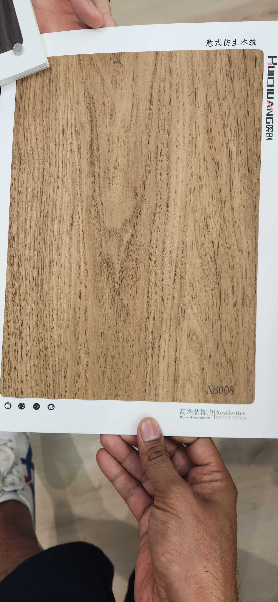

# Huichuang NB008 — Character Teak (Flat Cut, Knot Figure, Warm Honey)

**7.4 / 10 — Strong Contender** · Target: Teak (*Tectona grandis*, character flat cut, focal knot) · Cut: Flat cut — warm honey-golden with prominent knot figure · 2026-04-12

---

## Identity
| | |
|---|---|
| Brand | Huichuang / Aesthetics — 意式仿生木纹 (Italian Bio-Mimicry Wood Grain) |
| Product Code | NB008 |
| Label | 柚木 (Character Teak) |
| Target Species | Teak (*Tectona grandis*) — mature heartwood, warm honey-golden tone |
| Cut Simulated | Flat cut — wide grain bands with focal knot figure |
| Finish | Satin (~15–18% est.) — needs reduction to 8–12% |
| Pattern Repeat | ~1.5–2.5 m (short — knot figure limits usable repeat) |

---

## Score Breakdown
| | Score | Weight | Contribution |
|---|---|---|---|
| Species Demand (India) | 8.8 / 10 | 40% | 3.52 |
| Mimicry Quality | 6.5 / 10 | 60% | 3.90 |
| **Film Score** | **7.4 / 10** | | |

> Teak's unmatched India demand (8.8/10 — widest cross-segment pull in the catalog) drives the score despite only moderate mimicry. The knot figure is the film's most compelling visual asset — a focal mark that reads immediately as natural, mature timber. The limitation is pattern repeat: a knot-centred film tiles noticeably within 1.5–2.5 m, capping it from large continuous surfaces. Finish is 5–8% too high for premium channel but is the single fixable lever.

---

## Mimicry Quality — 6.5 / 10

| Dimension | Weight | Score | Note |
|---|---|---|---|
| Tone Accuracy | 15% | 7.0 | Warm honey-golden — accurate for mature teak heartwood; no reddish drift |
| Grain Pattern | 20% | 6.5 | Flat cut grain is well-executed; knot is dominant and natural-looking but limits repeat length |
| Tonal Variation | 15% | 7.0 | Good variation across grain bands — lighter and darker zones create visual movement |
| Heartwood-Sapwood | 10% | 6.5 | Subtle contrast at grain margins; real teak heartwood-sapwood transition is understated — acceptable |
| Pore / EIR Texture | 15% | 6.0 | Medium-open pore consistent with teak character; EIR alignment unclear from sample — physical inspection needed |
| Finish Level | 15% | 6.0 | ~15–18% estimated — correct lacquered look for trade channel; needs reduction to 8–12% for architect/spec |
| Depth Illusion | 10% | 6.5 | Knot figure adds genuine depth; surrounding flat grain is inherently 2D |

**The knot figure is this film's differentiator.** Within the teak family, NB009-1 also uses a knot mark but with a milder, more restrained execution. NB008's knot is larger and more focal — it reads like a dominant feature, not an accent. This creates stronger visual impact at the cost of shorter usable pattern repeat.

---

## Teak Family — Where NB008 Sits

| Film | Code | Cut | Tone | Finish | Knot | Score |
|---|---|---|---|---|---|---|
| Aesthetic Teak Rift | NB009+ | Rift | Honey-amber | Needs fix | None | 7.5 |
| Huichuang Teak Rich | NB016 | Flat | Deep golden-brown | Better | None | 7.5 |
| Huichuang Teak Char (Knot) | **NB008** | Flat + knot | Warm honey | Needs fix | **Focal** | **7.4** |
| Huichuang Teak Light | NB015 | Rift | Light honey | Calibrated | None | 7.4 |
| WiseWood Teak | — | Flat arch | Cathedral | Variable | None | 7.3 |
| Huichuang Teak Char | NB009-1 | Flat + knot | Warm golden | Needs fix | Accent | 7.4 |

NB008 and NB009-1 both use knot marks on flat-cut teak. NB008's knot is more dominant and centred — a stronger statement for buyers who want natural character. NB009-1's knot is softer and more peripheral — better for buyers who want suggestion over drama.

---

## India Market Fit

**Peak segments:** Heritage Buyers · Aspirational Professionals · Tier-2 Aspirants

**Best cities:** Chennai · Ahmedabad · Delhi NCR · Hyderabad · All Tier-2 · Mumbai (traditional residential)

| Application | Fit | Application | Fit |
|---|---|---|---|
| TV / Feature Wall | ✓✓ | Pooja Unit | ✓✓ |
| Bedroom Headboard | ✓✓ | Foyer / Entryway | ✓ |
| Wardrobe Shutters | ✓ | Kitchen Cabinets | ~ |
| Boutique Hospitality | ✓ | Heritage / Traditional | ✓✓ |
| Japandi | ✗ | Maximalist Luxury | ~ |

| Design Style | Alignment |
|---|---|
| Contemporary Indian (warm brief) | Very Strong |
| Heritage / Traditional | Very Strong |
| Neo-Classical / Transitional | Strong |
| Biophilic / Natural | Strong |
| Maximalist Luxury | Moderate |
| Japandi | Very Weak (warm tone + knot = wrong register) |

---

## Consumer Segment Resonance

| Segment | Score | Rationale |
|---|---|---|
| Heritage Buyers | 9.0 | Knot + flat grain = classic Indian teak aesthetic; immediately recognised as premium natural timber |
| Aspirational Professionals | 7.5 | Natural character wood appeal; fine for modern-traditional brief |
| Design-Forward Millennials | 4.5 | Too warm and rustic for Japandi briefs; no place in minimal palette |
| Tier-2 Aspirants | 8.5 | Knot-figure teak reads as aspirational premium; strong demand |

---

## The Knot Advantage

The knot figure earns commercial attention in ways plain-grain teak cannot:

| Property | Benefit |
|---|---|
| Immediately readable as natural | No explanation needed — buyers identify it as real wood character |
| Emotional engagement | Knots carry warmth, age, provenance — core to Indian wood aesthetics |
| Sample board impact | Stands out against plain-grain films in a side-by-side comparison |
| Heritage alignment | Traditional Indian wood furniture has knot character; this is a familiar signal |

**The risk:** Knots also tile. A 1.5 m repeat means in a 3 m panel run, the knot appears twice at the same height. Installation skill matters — joining panels at off-register offsets or using bookmatching to disguise the repeat is necessary for large surfaces.

---

## Pattern Repeat Guidance

| Surface | Feasibility | Installation Note |
|---|---|---|
| Single TV wall panel (≤2 m) | ✓✓ | Knot appears once — fully natural |
| 3 m bedroom headboard | ✓ | Knot repeats once — offset vertically at panel join |
| 4 m+ continuous run | ~ | Use two-panel offset or alternate panel direction to randomise knot position |
| Large open-plan wall (6 m+) | ✗ | Repeat becomes obvious without installation skill |

---

## Pairing Recommendations

| Pairing | Effect |
|---|---|
| Warm white / cream walls | Classic Indian residential — teak as feature, white as backdrop |
| Black metal frames / grilles | Contemporary traditional — the knot reads as artisanal against clean metal |
| NB016 (deep golden teak) | Full teak palette — NB008 as character accent, NB016 as ground surface |
| Marble/stone flooring (cream-beige) | Traditional luxury — warm teak + cool stone, classic Indian combination |
| Avoid: ash, pale oak, grey palette | Tone conflict — warm honey fights cool/light backgrounds |

---

## Verdict

**Sell here:** TV feature walls and bedroom headboards where the brief includes any reference to natural wood, teak heritage, or character grain. Pooja units where "natural, auspicious" is the ask. Traditional and neo-classical residential briefs in Tier-2 cities where the knot reads as premium maturity.

**Don't use for:** Japandi briefs, minimal contemporary, Bengaluru/Pune architect-spec channel (too warm and rustic), or large continuous surfaces without installation expertise.

**Priority fix:** Reduce finish to 8–12% satin. At 15–18%, the sheen reads as artificial and undermines the natural-teak appeal that is this film's core proposition. The finish fix alone would push mimicry from 6.5 to approximately 7.0 — adding ~0.3 to the film score.

**Core insight:** NB008 is the most persuasively natural-looking film in the teak family. The knot figure delivers immediate emotional resonance that rift-grain and plain flat-grain films cannot replicate. Use it for character-wood briefs and buyers who say "I want it to look like real wood." Install carefully on large surfaces. Reduce the finish. Those are the only actions needed.
