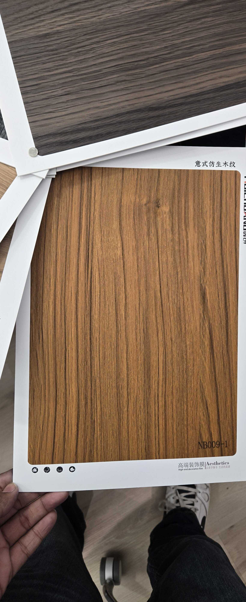

# Huichuang NB009-1 — Teak (Flat Cut, Character)

**7.4 / 10 — Strong Contender** · Target: Teak (*Tectona grandis*) · Cut: Flat cut (mild cathedral + character mark) · 2026-04-12

---

## Identity
| | |
|---|---|
| Brand | Huichuang (惠创) / Aesthetics |
| Product Code | NB009-1 |
| Label | 意式仿生木纹 — Italian-style bionic wood grain |
| Target Species | Teak (*Tectona grandis*) |
| Cut Simulated | Flat cut — mild flowing character + small knot mark |
| Finish | Satin (~15% sheen) — slightly high |
| Pattern Repeat | ~1.5–2.0 m (est.) |

---

## Score Breakdown
| | Score | Weight | Contribution |
|---|---|---|---|
| Species Demand (India) | 8.8 / 10 | 40% | 3.52 |
| Mimicry Quality | 6.5 / 10 | 60% | 3.90 |
| **Film Score** | **7.4 / 10** | | |

> Flat-cut variant of NB009+. The character mark adds wood authenticity but flat-cut execution is harder to sustain over repeat — scored 0.1 below the rift-cut NB009+.

---

## Teak Series Positioning — NB009 Family

| Film | Cut | Tone | Grain | Finish | Score |
|---|---|---|---|---|---|
| NB009+ | Rift — straight | Golden-amber | Clean, no drama | ~15–20% | 7.5 |
| NB009-1 | Flat — mild character | Golden-amber | Flowing + knot mark | ~15% | 7.4 |
| NB016 | Flat — richer | Deep golden-brown | Confident parallel | ~12–15% | 7.5 |

---

## Mimicry Quality — 6.5 / 10

| Dimension | Weight | Score | Note |
|---|---|---|---|
| Tone Accuracy | 15% | 7.0 | Warm golden-amber — correct teak register |
| Grain Pattern | 20% | 7.0 | Flat cut with flowing character and knot mark — adds authenticity |
| Tonal Variation | 15% | 6.5 | Moderate — lighter and darker zones visible |
| Heartwood-Sapwood | 10% | 5.5 | Absent — shared gap across teak films |
| Pore / EIR Texture | 15% | 6.0 | Some texture present; EIR unconfirmed |
| Finish Level | 15% | 6.0 | ~15% — one step too high; 8–12% unlocks premium channel |
| Depth Illusion | 10% | 6.5 | Knot mark adds modest depth benefit |

---

## India Market Fit

**Peak segments:** Heritage Buyers · Aspirational Professionals · Tier-2 Aspirants

**Best cities:** Chennai · Ahmedabad · Delhi NCR · Hyderabad · All Tier-2

| Application | Fit | Application | Fit |
|---|---|---|---|
| TV / Media Wall | ✓✓ | Bedroom Headboard | ✓✓ |
| Wardrobe Shutters | ✓ | Pooja Unit | ✓ |
| Foyer / Entryway | ✓ | Kitchen Cabinets | ~ |

| Design Style | Alignment |
|---|---|
| Contemporary Indian | Strong |
| Heritage / Traditional | Strong |
| Neo-Classical | Strong |
| Japandi | Weak |

---

## Gap to Top 3 (8.5 threshold)
**Gap: 1.1 points.** Same demand advantage (8.8) — finish correction + EIR upgrade closes 0.5 points.

Priority improvements:
1. **Finish reduction** — 15% → 8–12% satin — highest single-step gain
2. **EIR upgrade** — pore channel alignment to grain lines
3. **Heartwood-sapwood band** — cream edge adds 0.5–0.7 mimicry points

---

## Verdict

**Sell here:** Traditional and transitional Indian residential — TV walls, bedrooms, pooja units across all cities. The knot mark makes it the most "natural-looking" teak option for buyers who know wood.

**Don't use for:** Japandi briefs, kitchens, clinical modern applications.

**Priority fix:** Reduce finish to 8–12%. The knot character is a genuine commercial asset — don't lose it to a fixable finish issue.

**Core insight:** In the NB009 teak family, NB009-1 is the traditional brief option. Sell it to buyers who want teak to look like it came off a real log — the flat cut and character mark do that job. NB009+ serves the clean-spec brief; NB009-1 serves the character brief.
