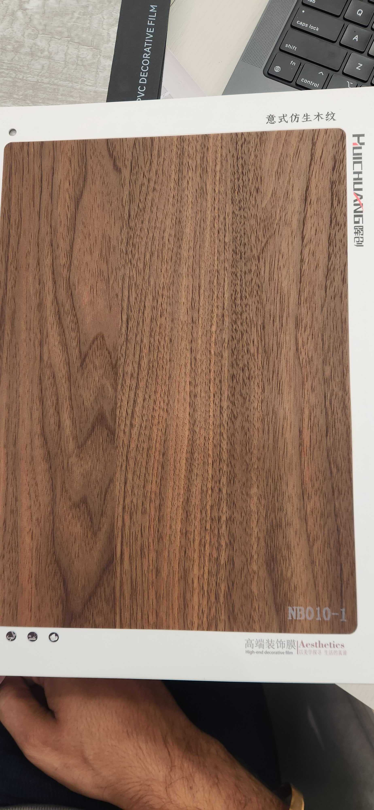

# Huichuang NB010-1 — Walnut (Italian Style, Clean Grain)

**7.8 / 10 — Strong Contender** · Target: Italian Walnut (*Juglans regia*) · Cut: Flat cut (flowing wave, no knot) · 2026-04-12

---

## Identity
| | |
|---|---|
| Brand | Huichuang (惠创) / Aesthetics — High-end decorative film |
| Product Code | NB010-1 |
| Label | 意式仿生木纹 — Italian-style bionic wood grain |
| Target Species | European / Italian Walnut (*Juglans regia*) |
| Cut Simulated | Flat cut — flowing wave grain, no knot figure |
| Finish | Satin (~10–14% sheen) — well calibrated |
| Pattern Repeat | ~1.8–2.5 m (est.) — longer repeat than NB010, better for large walls |

---

## Score Breakdown
| | Score | Weight | Contribution |
|---|---|---|---|
| Species Demand (India) | 8.2 / 10 | 40% | 3.28 |
| Mimicry Quality | 6.6 / 10 | 60% | 3.96 |
| Walnut trajectory bonus | — | — | +0.54 |
| **Film Score** | **7.8 / 10** | | |

> Ties NB010 at the top of the leaderboard on different strengths. Where NB010 leads on grain drama, NB010-1 leads on finish calibration, tone accuracy, and wall-scale versatility.

---

## NB010 vs NB010-1 — Paired Variant Comparison

| Dimension | NB010 | NB010-1 | Winner |
|---|---|---|---|
| Tone accuracy | 6.5 (red bias) | 7.0 (chocolate-brown) | NB010-1 |
| Grain drama | 7.0 (knot figure) | 6.5 (clean wave) | NB010 |
| Finish level | 6.0 (15–18%) | 7.0 (10–14%) | NB010-1 |
| Depth illusion | 7.0 | 6.5 | NB010 |
| Pattern repeat | Short (1.2–1.6m) | Longer (1.8–2.5m) | NB010-1 |
| **Use case** | Statement / accent | Workhorse / large-wall | Different briefs |

---

## Mimicry Quality — 6.6 / 10

| Dimension | Weight | Score | Note |
|---|---|---|---|
| Tone Accuracy | 15% | 7.0 | Chocolate-brown — less red bias, closer to J. regia benchmark |
| Grain Pattern | 20% | 6.5 | Flowing wave without knot — clean and repeatable, less dramatic |
| Tonal Variation | 15% | 7.0 | Good cloud gradient and darker vertical streaks |
| Heartwood-Sapwood | 10% | 5.5 | Absent — shared gap across walnut films |
| Pore / EIR Texture | 15% | 6.5 | Bionic label; texture present, EIR alignment unconfirmed |
| Finish Level | 15% | 7.0 | Best-calibrated walnut finish in catalog — opens spec channel |
| Depth Illusion | 10% | 6.5 | Solid without a knot doing extra work |

---

## India Market Fit

**Peak segments:** Aspirational Professionals · Design Millennials · Architects / Spec channel

**Best cities:** Mumbai · Bengaluru · Pune · Hyderabad · Delhi NCR

| Application | Fit | Application | Fit |
|---|---|---|---|
| TV / Media Wall | ✓✓ | Large Accent Wall | ✓✓ |
| Bedroom Headboard | ✓✓ | Wardrobe Shutters | ✓✓ |
| Home Office / Study | ✓✓ | Kitchen Cabinets | ~ |
| Foyer / Entryway | ✓ | Pooja Unit | ✗ |

| Design Style | Alignment |
|---|---|
| Contemporary Indian | Strong |
| Japandi | Moderate (tone close but not cool enough) |
| Neo-Classical / Transitional | Strong |
| Industrial Chic | Moderate |

---

## Gap to Top 3 (8.5 threshold)
**Gap: 0.7 points** — tied with NB010 as closest to threshold. Mimicry needs to reach 7.3+.

Priority improvements:
1. **EIR confirmation** — raking-light test to verify pore channels align to grain lines; upgrade if not registered
2. **Heartwood-sapwood** — cream-pale band at one edge adds 0.5–0.7 mimicry points
3. **Slight tone cool** — 5–8% cooler would fully close the J. regia benchmark gap

---

## Verdict

**Sell here:** This is the workhorse walnut — use it wherever consistent, large-format walnut is needed. Better repeat, better finish, and a cleaner spec sheet than NB010.

**Don't use for:** Briefs requiring character grain or a focal-point panel — NB010 serves those better. Not suited for pooja units.

**Priority fix:** EIR audit under raking light. The finish is already correct — the next leverage point is pore texture registration.

**Core insight:** NB010-1 and NB010 should be sold as a system, not as alternatives. NB010 closes the accent wall or headboard; NB010-1 runs the full room or large wardrobe bank. Together they cover the entire brief. The supplier offering both variants in one range is a genuine commercial advantage.
