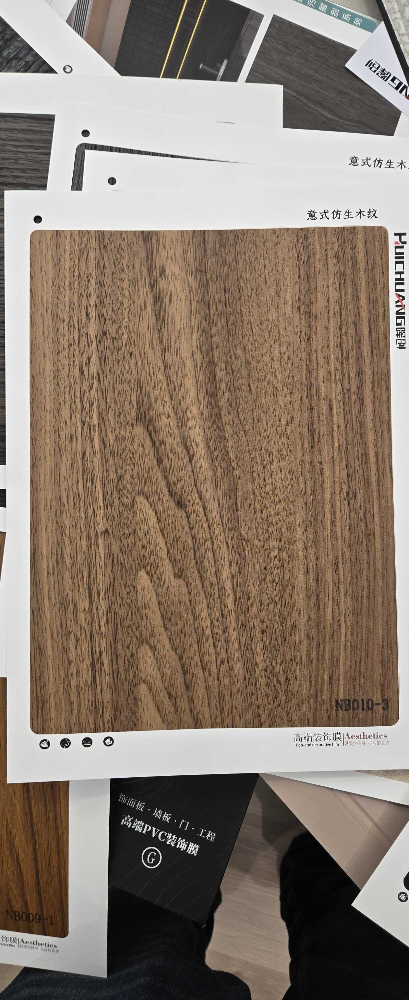

# Huichuang NB010-3 — Walnut (Flat Cut, Character Figure)

**7.8 / 10 — Strong Contender** · Target: European / Italian Walnut (*Juglans regia*) · Cut: Flat cut (complex figure intersection) · 2026-04-12

---

## Identity
| | |
|---|---|
| Brand | Huichuang (惠创) / Aesthetics |
| Product Code | NB010-3 |
| Label | 意式仿生木纹 — Italian-style bionic wood grain |
| Target Species | European / Italian Walnut (*Juglans regia*) |
| Cut Simulated | Flat cut — flowing grain with focal figure intersection |
| Finish | Satin (~15–18% sheen) — needs reduction |
| Pattern Repeat | ~1.2–1.8 m (est.) — figure intersection shortens usable repeat |

---

## Score Breakdown
| | Score | Weight | Contribution |
|---|---|---|---|
| Species Demand (India) | 8.2 / 10 | 40% | 3.28 |
| Mimicry Quality | 6.6 / 10 | 60% | 3.96 |
| Walnut trajectory bonus | — | — | +0.54 |
| **Film Score** | **7.8 / 10** | | |

> The character variant in the NB010 flat family. A complex convergence of grain lines creates a focal figure — not a knot, but a dramatic natural-looking intersection that reads as high-character premium walnut.

---

## NB010 Family — Character Comparison

| Film | Figure Type | Focal Drama | Best Use |
|---|---|---|---|
| NB010 | Oval knot | Very high | Statement accent panel |
| NB010-3 | Grain convergence figure | High | Feature wall, headboard |
| NB010-4 | Clean dark wave | Moderate | TV wall, large wardrobe |
| NB010-1 | Clean wave | Moderate | Large-format workhorse |

---

## Mimicry Quality — 6.6 / 10

| Dimension | Weight | Score | Note |
|---|---|---|---|
| Tone Accuracy | 15% | 7.0 | Warm chocolate-brown with slight reddish undertone — J. regia register |
| Grain Pattern | 20% | 7.0 | Complex figure intersection — reads like natural grain convergence |
| Tonal Variation | 15% | 7.0 | Strong gradient around figure — dark and light zones contrast well |
| Heartwood-Sapwood | 10% | 5.5 | Absent — shared gap |
| Pore / EIR Texture | 15% | 6.5 | Bionic label; texture present, EIR unconfirmed |
| Finish Level | 15% | 6.0 | ~15–18% — too high; highest-priority fix |
| Depth Illusion | 10% | 7.0 | Figure convergence creates strong perceived depth |

**Second most dramatic grain in the walnut series after NB010 knot.** The character figure is a genuine commercial asset — reads as a natural log characteristic to discerning buyers.

---

## India Market Fit

**Peak segments:** Aspirational Professionals · Design Millennials · Heritage Buyers (premium tier)

**Best cities:** Mumbai · Bengaluru · Pune · Hyderabad · Delhi NCR

| Application | Fit | Application | Fit |
|---|---|---|---|
| Bedroom Headboard | ✓✓ | TV / Media Wall | ✓✓ |
| Foyer / Entryway | ✓✓ | Home Office / Study | ✓✓ |
| Feature Accent Wall | ✓✓ | Wardrobe Shutters | ✓ |
| Kitchen Cabinets | ~ | Pooja Unit | ✗ |

| Design Style | Alignment |
|---|---|
| Contemporary Indian | Strong |
| Neo-Classical / Transitional | Strong |
| Industrial Chic | Moderate |
| Japandi | Weak |

---

## Gap to Top 3 (8.5 threshold)
**Gap: 0.7 points.** Same gap as other NB010 variants. Finish reduction is the highest-leverage single action.

Priority improvements:
1. **Finish reduction** — 15–18% → 10–14% satin; critical — this is too high for premium channel
2. **EIR upgrade** — pore alignment adds 0.4 mimicry points
3. **Heartwood-sapwood** — cream edge adds 0.5–0.7 mimicry points

---

## Verdict

**Sell here:** Feature walls, headboards, foyers — anywhere a buyer wants walnut with natural character but not a full knot. The figure intersection is a conversation point without overwhelming the design.

**Don't use for:** Large continuous surfaces (short repeat limits scalability), pooja units.

**Priority fix:** Finish reduction is urgent. At 15–18% the premium character of this grain is undermined by the sheen. Drop to 10–14% and this film is immediately spec-channel ready.

**Core insight:** NB010-3 fills the gap between NB010 (dramatic knot) and NB010-1 (clean wave). The figure convergence is the most "natural-looking" walnut grain without a literal knot — ideal for buyers who want premium character without the bold statement of a knot figure. Sell it as "character walnut" vs NB010's "statement walnut."
