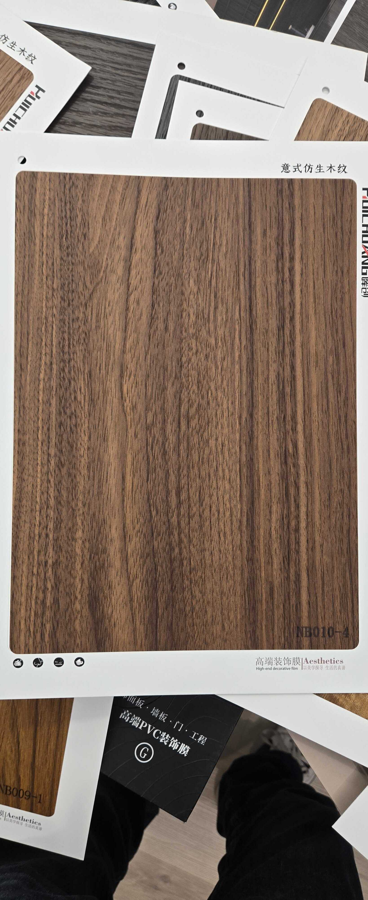

# Huichuang NB010-4 — Walnut (Flat Cut, Rich Dark)

**7.8 / 10 — Strong Contender** · Target: European / Italian Walnut (*Juglans regia*) · Cut: Flat cut (rich flowing grain, dark) · 2026-04-12

---

## Identity
| | |
|---|---|
| Brand | Huichuang (惠创) / Aesthetics |
| Product Code | NB010-4 |
| Label | 意式仿生木纹 — Italian-style bionic wood grain |
| Target Species | European / Italian Walnut (*Juglans regia*) |
| Cut Simulated | Flat cut — rich flowing wave grain, no knot, dark chocolate-brown |
| Finish | Satin (~12–16% sheen) — slightly high |
| Pattern Repeat | ~1.8–2.5 m (est.) |

---

## Score Breakdown
| | Score | Weight | Contribution |
|---|---|---|---|
| Species Demand (India) | 8.2 / 10 | 40% | 3.28 |
| Mimicry Quality | 6.6 / 10 | 60% | 3.96 |
| Walnut trajectory bonus | — | — | +0.54 |
| **Film Score** | **7.8 / 10** | | |

> Darkest and richest of the NB010 flat-cut walnut variants. Deep chocolate-brown with strong tonal contrast — reads premium and mature. The go-to NB010 variant for dramatic dark-walnut briefs.

---

## NB010 Family — Complete Positioning

| Film | Grain | Tone | Drama | Score |
|---|---|---|---|---|
| NB010 | Knot figure + wave | Chocolate-brown (red bias) | High | 7.8 |
| NB010-1 | Wave — clean | Chocolate-brown | Moderate | 7.8 |
| NB010-3 | Wave — character figure | Warm chocolate | High | 7.8 |
| NB010-4 | Wave — rich dark | Deep chocolate-brown | Moderate-high | 7.8 |

---

## Mimicry Quality — 6.6 / 10

| Dimension | Weight | Score | Note |
|---|---|---|---|
| Tone Accuracy | 15% | 7.0 | Deep chocolate-brown — strong J. regia register, richer than NB010 |
| Grain Pattern | 20% | 7.0 | Flowing wave grain with strong vertical streaks — convincing flat-cut walnut |
| Tonal Variation | 15% | 7.0 | Best tonal contrast in NB010 flat variants — dark against lighter zones |
| Heartwood-Sapwood | 10% | 5.5 | Absent — shared gap |
| Pore / EIR Texture | 15% | 6.5 | Bionic label; texture present, EIR alignment unconfirmed |
| Finish Level | 15% | 6.0 | ~12–16% — slightly too high; reduce to 10–14% |
| Depth Illusion | 10% | 7.0 | Tonal contrast and flowing grain create convincing depth |

**Richest tonal execution in the NB010 flat family.** Where NB010-1 has better finish and longer repeat, NB010-4 wins on colour depth and tonal drama.

---

## India Market Fit

**Peak segments:** Aspirational Professionals · Design Millennials · Architects / Spec channel

**Best cities:** Mumbai · Bengaluru · Pune · Hyderabad · Delhi NCR

| Application | Fit | Application | Fit |
|---|---|---|---|
| TV / Media Wall | ✓✓ | Bedroom Headboard | ✓✓ |
| Wardrobe Shutters | ✓✓ | Home Office / Study | ✓✓ |
| Large Accent Wall | ✓✓ | Foyer / Entryway | ✓ |
| Kitchen Cabinets | ~ | Pooja Unit | ✗ |

| Design Style | Alignment |
|---|---|
| Contemporary Indian | Strong |
| Neo-Classical / Transitional | Strong |
| Industrial Chic | Strong |
| Japandi | Weak |

---

## Gap to Top 3 (8.5 threshold)
**Gap: 0.7 points** — same gap as NB010 and NB010-1. Mimicry needs to reach 7.3+.

Priority improvements:
1. **Finish reduction** — 12–16% → 10–14% satin; single-highest step gain
2. **EIR confirmation** — pore channel alignment under raking light
3. **Heartwood-sapwood band** — pale edge adds 0.5–0.7 mimicry points

---

## Verdict

**Sell here:** Anywhere dark walnut is requested — TV walls, bedrooms, home offices. The richest colour in the NB010 flat family makes this the instinctive choice for "dramatic dark walnut" briefs.

**Don't use for:** Briefs requiring knot drama (use NB010), light-toned applications, pooja units.

**Priority fix:** Reduce finish to 10–14%. The colour depth is the commercial asset — don't let a correctable finish hold it back.

**Core insight:** In the NB010 family, the recommendation is: NB010 for knot/character drama, NB010-1 for large-wall workhorse, NB010-4 for maximum colour richness. Use NB010-4 when the brief says "dark walnut" and the client wants impact without a visible knot.
