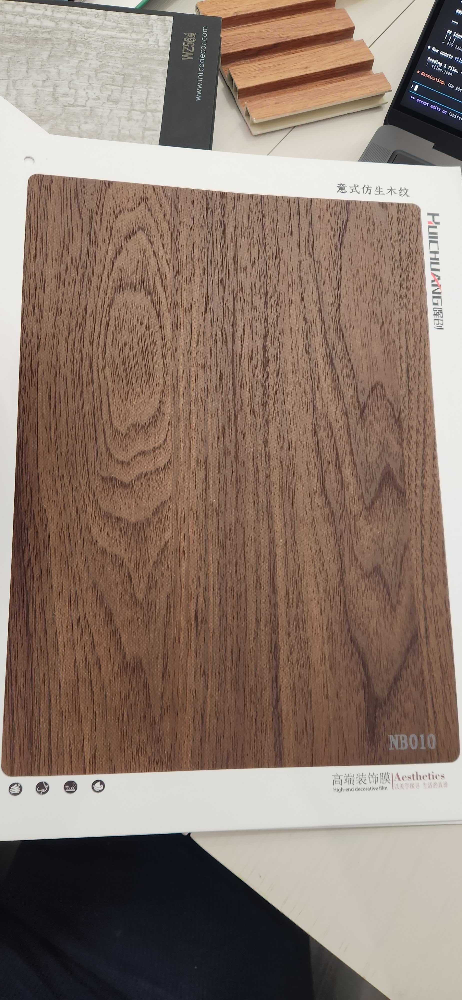

# Huichuang NB010 — Walnut (Italian Style, Flat Cut)

**7.8 / 10 — Strong Contender** · Target: Italian Walnut (*Juglans regia*) · Cut: Flat cut (knot + flowing figure) · 2026-04-12

---

## Identity
| | |
|---|---|
| Brand | Huichuang (惠创) / Aesthetics — High-end decorative film |
| Product Code | NB010 |
| Label | 意式仿生木纹 — Italian-style bionic wood grain |
| Target Species | European / Italian Walnut (*Juglans regia*) |
| Cut Simulated | Flat cut — prominent oval knot figure + flowing wave grain |
| Finish | Satin (~15–18% sheen) — needs reduction |
| Pattern Repeat | ~1.2–1.6 m (est.) — knot figure limits large-wall use |

---

## Score Breakdown
| | Score | Weight | Contribution |
|---|---|---|---|
| Species Demand (India) | 8.2 / 10 | 40% | 3.28 |
| Mimicry Quality | 6.6 / 10 | 60% | 3.96 |
| Walnut trajectory bonus | — | — | +0.54 |
| **Film Score** | **7.8 / 10** | | |

> The knot figure is the defining differentiator. It adds visual depth and wood character no straight-grain walnut film can match — but it also shortens the effective pattern repeat.

---

## Mimicry Quality — 6.6 / 10

| Dimension | Weight | Score | Note |
|---|---|---|---|
| Tone Accuracy | 15% | 6.5 | Warm-brown correct zone; slight red bias — J. regia benchmark is more chocolate-brown |
| Grain Pattern | 20% | 7.0 | Oval knot + flowing wave — most visually complex walnut in catalog |
| Tonal Variation | 15% | 7.0 | Good cloud gradient; darker streaks naturalistic |
| Heartwood-Sapwood | 10% | 5.5 | Absent — shared gap across all walnut films evaluated |
| Pore / EIR Texture | 15% | 6.5 | "Bionic" claim suggests EIR; texture visible, alignment unconfirmed |
| Finish Level | 15% | 6.0 | ~15–18% — needs to drop to 10–14% for premium specification |
| Depth Illusion | 10% | 7.0 | Best depth illusion in the walnut category — knot figure does real work |

**Key advantage over ART DECOR Walnut:** Knot figure adds character dimension that flat grain can't replicate. Depth illusion score 7.0 vs 6.0. Scores 0.3 points higher on overall mimicry.

**Key risk:** A prominent knot on a printed film can read as artificial at close inspection or under raking light. Strongest in ambient / diffuse lighting conditions.

---

## India Market Fit

**Peak segments:** Aspirational Professionals · Design Millennials · Heritage Buyers (character grain appeals across segments)

**Best cities:** Mumbai · Bengaluru · Pune · Hyderabad · Delhi NCR

| Application | Fit | Application | Fit |
|---|---|---|---|
| TV / Media Wall | ✓✓ | Bedroom Headboard | ✓✓ |
| Home Office / Study | ✓✓ | Wardrobe Shutters | ✓ |
| Foyer / Entryway | ✓✓ | Dining Accent Wall | ✓ |
| Kitchen Cabinets | ~ | Pooja Unit | ✗ |

| Design Style | Alignment |
|---|---|
| Contemporary Indian | Strong |
| Japandi | Moderate (tone too warm for strict briefs) |
| Neo-Classical / Transitional | Strong |
| Industrial Chic | Moderate |
| Heritage / Traditional | Moderate |

---

## Gap to Top 3 (8.5 threshold)
**Gap: 0.7 points** — closest to threshold in catalog. Mimicry needs to reach 7.3+ to break 8.5.

Priority improvements:
1. **Cool and deepen tone** — shift 15% toward chocolate-brown, away from red-warm; closes the J. regia benchmark gap
2. **Finish reduction** — 15–18% → 10–14% satin; unlocks architect and premium specification channel
3. **Heartwood-sapwood** — cream-pale band at one edge; would add 0.5–0.7 mimicry points

---

## Verdict

**Sell here:** TV walls, bedroom headboards, foyer panels for aspirational professionals in Mumbai, Bengaluru, Pune. The knot figure makes it a conversation piece — use this positioning.

**Don't use for:** Large-wall installations where pattern repeat is visible (knot repeats quickly), strict Japandi briefs (tone too warm), pooja units.

**Priority fix:** Cool the tone and reduce the finish. Two changes, both achievable at reformulation — this is the film most likely to break 8.5 in this catalog.

**Core insight:** #1 on the leaderboard. The knot figure differentiates this from every other walnut film — no flat-grain competitor can replicate what a well-placed oval figure does for perceived wood authenticity. Position it as the premium character option against the ART DECOR walnut's cleaner, safer grain.
