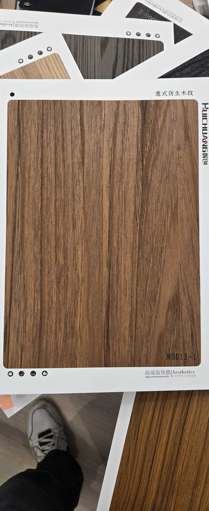

# Huichuang NB011-1 — Walnut (Flat Cut, Dark Rich)

**7.7 / 10 — Strong Contender** · Target: American / European Walnut (*Juglans nigra / regia*) · Cut: Flat cut (flowing grain, dark) · 2026-04-12

---

## Identity
| | |
|---|---|
| Brand | Huichuang (惠创) / Aesthetics |
| Product Code | NB011-1 |
| Label | 意式仿生木纹 — Italian-style bionic wood grain |
| Target Species | American / European Walnut (*Juglans nigra / regia*) |
| Cut Simulated | Flat cut — flowing grain lines, medium-dark tone |
| Finish | Satin (~12–15% sheen) — close to target |
| Pattern Repeat | ~1.5–2.2 m (est.) |

---

## Score Breakdown
| | Score | Weight | Contribution |
|---|---|---|---|
| Species Demand (India) | 8.2 / 10 | 40% | 3.28 |
| Mimicry Quality | 6.4 / 10 | 60% | 3.84 |
| Walnut trajectory bonus | — | — | +0.54 |
| **Film Score** | **7.7 / 10** | | |

> Darker and richer than NB011 — better tone accuracy, more convincing flowing grain. The premium variant in the NB011 family. Sits between NB011 and NB010-series in the walnut hierarchy.

---

## NB011 Family vs NB010 Series

| Film | Tone | Grain Drama | Score | Best Use |
|---|---|---|---|---|
| NB011 | Medium warm brown | Low | 7.6 | Volume / background |
| NB011-1 | Medium-dark warm brown | Moderate | 7.7 | Feature panels, mid-tier |
| NB010-1 | Chocolate-brown | Moderate-high | 7.8 | Large walls, workhorse premium |
| NB010 | Chocolate-brown + knot | High | 7.8 | Accent / statement |

---

## Mimicry Quality — 6.4 / 10

| Dimension | Weight | Score | Note |
|---|---|---|---|
| Tone Accuracy | 15% | 7.0 | Medium-dark warm brown — better J. nigra register than NB011 |
| Grain Pattern | 20% | 6.5 | Flat cut with flowing grain — more character than NB011 |
| Tonal Variation | 15% | 6.5 | Moderate variation — darker streaks against lighter base |
| Heartwood-Sapwood | 10% | 5.5 | Absent — shared gap |
| Pore / EIR Texture | 15% | 6.0 | Some texture; EIR unconfirmed |
| Finish Level | 15% | 6.5 | ~12–15% — reduce to 10–14% |
| Depth Illusion | 10% | 6.5 | Flowing grain provides moderate depth benefit |

**One step above NB011 in every dimension.** The darker tone is the key differentiator — it reads more premium and closer to American walnut benchmark.

---

## India Market Fit

**Peak segments:** Aspirational Professionals · Design Millennials · Architects

**Best cities:** Mumbai · Bengaluru · Pune · Hyderabad · Delhi NCR

| Application | Fit | Application | Fit |
|---|---|---|---|
| TV / Media Wall | ✓✓ | Bedroom Headboard | ✓✓ |
| Wardrobe Shutters | ✓✓ | Home Office / Study | ✓✓ |
| Large Accent Wall | ✓✓ | Kitchen Cabinets | ~ |
| Foyer / Entryway | ✓ | Pooja Unit | ✗ |

| Design Style | Alignment |
|---|---|
| Contemporary Indian | Strong |
| Neo-Classical / Transitional | Strong |
| Industrial Chic | Moderate |
| Japandi | Weak |

---

## Gap to Top 3 (8.5 threshold)
**Gap: 0.8 points.** Mimicry improvement to 7.0+ (achievable with finish fix + EIR) + walnut trajectory = strong candidate.

Priority improvements:
1. **Finish reduction** — 12–15% → 10–12% satin
2. **EIR audit** — raking-light confirmation of pore alignment
3. **Heartwood-sapwood band** — pale edge adds 0.5 mimicry points

---

## Verdict

**Sell here:** Mid-premium walnut briefs across all major metros — this is the right film when NB010 series feels too expensive or overdramatic. Covers 70% of walnut briefs at a likely lower price point.

**Don't use for:** Statement accent walls (use NB010 for knot drama), pooja units.

**Priority fix:** Reduce finish to 10–12%. The tone is already correct for the market — finish is the only barrier to the premium channel.

**Core insight:** NB011-1 is the bridge walnut — darker than NB011 (more convincing), less dramatic than NB010 (safer for volume). This is the most commercially versatile walnut for mid-market residential.
