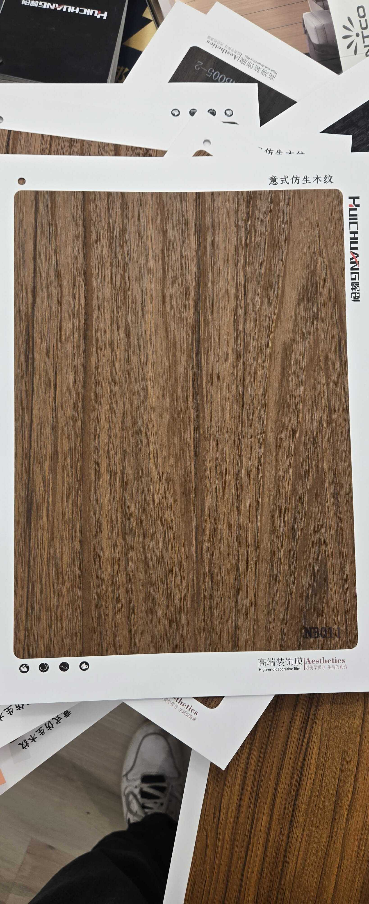

# Huichuang NB011 — Walnut (Flat Cut, Standard)

**7.6 / 10 — Strong Contender** · Target: European / American Walnut (*Juglans regia / nigra*) · Cut: Flat cut (straight-flowing grain) · 2026-04-12

---

## Identity
| | |
|---|---|
| Brand | Huichuang (惠创) / Aesthetics |
| Product Code | NB011 |
| Label | 意式仿生木纹 — Italian-style bionic wood grain |
| Target Species | European / American Walnut (*Juglans regia / nigra*) |
| Cut Simulated | Flat cut — straight-flowing grain, moderate tonal contrast |
| Finish | Satin (~12–16% sheen) — slightly high |
| Pattern Repeat | ~1.5–2.5 m (est.) |

---

## Score Breakdown
| | Score | Weight | Contribution |
|---|---|---|---|
| Species Demand (India) | 8.2 / 10 | 40% | 3.28 |
| Mimicry Quality | 6.3 / 10 | 60% | 3.78 |
| Walnut trajectory bonus | — | — | +0.54 |
| **Film Score** | **7.6 / 10** | | |

> Entry-level walnut in the Huichuang NB011 family. Correct walnut tone register with straight grain — a credible workhorse. Lacks the drama and finish quality of higher-ranked walnut films but covers high-volume, cost-sensitive briefs.

---

## NB011 Family Positioning

| Film | Grain | Tone | Finish | Score |
|---|---|---|---|---|
| NB011 | Flat — straight, plain | Medium warm brown | ~12–16% | 7.6 |
| NB011-1 | Flat — flowing, richer | Medium-dark warm brown | ~12–15% | 7.7 |

---

## Mimicry Quality — 6.3 / 10

| Dimension | Weight | Score | Note |
|---|---|---|---|
| Tone Accuracy | 15% | 6.5 | Medium warm brown — lighter than J. nigra benchmark; correct walnut register |
| Grain Pattern | 20% | 6.5 | Flat cut, mostly straight with minimal drama — believable but plain |
| Tonal Variation | 15% | 6.5 | Moderate variation — lighter and darker zones present |
| Heartwood-Sapwood | 10% | 5.5 | Absent — shared gap across walnut films |
| Pore / EIR Texture | 15% | 6.0 | Some texture; EIR alignment unconfirmed |
| Finish Level | 15% | 6.0 | ~12–16% — reduce to 10–14% to unlock premium channel |
| Depth Illusion | 10% | 6.0 | Limited — no knot or figure to add depth |

**Lowest mimicry in the NB011 walnut family — but the weaknesses are correctable.** The plain grain is not a defect; it suits volume applications where a neutral background walnut is preferred.

---

## India Market Fit

**Peak segments:** Aspirational Professionals · Tier-2 Aspirants · Volume residential

**Best cities:** Mumbai · Bengaluru · Pune · Hyderabad · Delhi NCR · All Tier-2

| Application | Fit | Application | Fit |
|---|---|---|---|
| TV / Media Wall | ✓✓ | Wardrobe Shutters | ✓✓ |
| Bedroom Headboard | ✓✓ | Kitchen Cabinets | ✓ |
| Home Office / Study | ✓ | Foyer / Entryway | ~ |
| Large Accent Wall | ✓ | Pooja Unit | ✗ |

| Design Style | Alignment |
|---|---|
| Contemporary Indian | Strong |
| Neo-Classical / Transitional | Moderate |
| Japandi | Weak (tone too warm) |
| Industrial Chic | Moderate |

---

## Gap to Top 3 (8.5 threshold)
**Gap: 0.9 points.** Closer than the score implies — walnut trajectory means improvements compound. Mimicry needs to reach 7.0+.

Priority improvements:
1. **Finish reduction** — 12–16% → 10–14% satin; highest single-step gain
2. **EIR upgrade** — pore channels aligned to grain; +0.3–0.5 mimicry
3. **Tone deepening** — 10–15% darker toward chocolate-brown benchmark

---

## Verdict

**Sell here:** High-volume residential walnut — wardrobes, TV walls, bedrooms across all cities. This is the cost-efficient walnut for volume briefs where budget constrains the NB010 series.

**Don't use for:** Feature walls, statement panels, luxury HNI briefs (use NB010/NB010-1/NB010-3/NB010-4 instead), pooja units.

**Priority fix:** Reduce finish to 10–14% satin. The grain is adequate — finish is the fastest correctable gain.

**Core insight:** NB011 is the volume walnut — sell it where the brief needs walnut character on a tight budget. Pair with NB011-1 for a two-variant walnut offering: NB011 for background surfaces, NB011-1 for feature panels.
