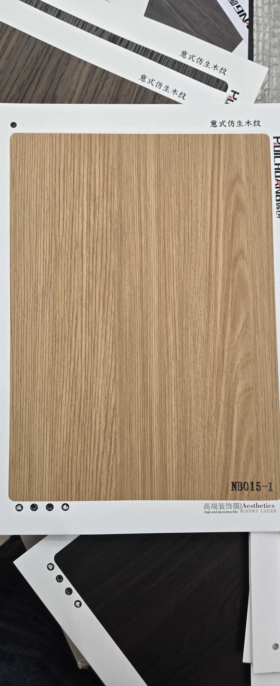

# Huichuang NB015-1 — Oak (Flat Cut, Light)

**7.2 / 10 — Strong Contender** · Target: European Oak (*Quercus robur*) · Cut: Flat cut (clean, minimal cathedral) · 2026-04-12

---

## Identity
| | |
|---|---|
| Brand | Huichuang (惠创) / Aesthetics |
| Product Code | NB015-1 |
| Label | 意式仿生木纹 — Italian-style bionic wood grain |
| Target Species | European Oak (*Quercus robur*) — light, clean register |
| Cut Simulated | Flat cut — near-straight grain with very minimal cathedral arch |
| Finish | Satin (~10–14% sheen) — well calibrated |
| Pattern Repeat | ~2.0–3.0 m (est.) — clean grain allows good repeat |

---

## Score Breakdown
| | Score | Weight | Contribution |
|---|---|---|---|
| Species Demand (India) | 7.2 / 10 | 40% | 2.88 |
| Mimicry Quality | 6.5 / 10 | 60% | 3.90 |
| Japandi flat premium | — | — | +0.25 |
| Japandi trend premium | — | — | +0.07 |
| **Film Score** | **7.2 / 10** | | |

> Cleanest-toned oak in the catalog — lighter and cooler than NB003. The near-flat grain limits the Japandi premium vs rift cut, but the light honey tone opens applications in minimalist and Scandinavian-influenced briefs.

---

## Oak Series Positioning

| Film | Cut | Tone | Finish | Score |
|---|---|---|---|---|
| ART DECOR Oak | Rift | Honey-blonde | ~5–12% matte | 7.5 |
| NB003 | Flat — cathedral | Honey-blonde | ~6–10% matte | 7.5 |
| NB015-1 | Flat — clean | Honey-blonde (lighter) | ~10–14% satin | 7.2 |

---

## Mimicry Quality — 6.5 / 10

| Dimension | Weight | Score | Note |
|---|---|---|---|
| Tone Accuracy | 15% | 7.0 | Light honey-blonde — on target for European Oak, slightly cool |
| Grain Pattern | 20% | 7.0 | Very clean near-straight grain — credible flat oak |
| Tonal Variation | 15% | 6.0 | Very uniform — limited light/dark contrast |
| Heartwood-Sapwood | 10% | 6.0 | Mild transition present; less critical for oak |
| Pore / EIR Texture | 15% | 6.5 | Texture visible; EIR registration unconfirmed |
| Finish Level | 15% | 7.0 | ~10–14% satin — slightly above ideal matte for oak (target 6–10%) |
| Depth Illusion | 10% | 6.0 | Very clean — lacks depth cues |

**Cleanest, most uniform oak in the catalog.** Where NB003 has a cathedral arch, NB015-1 is nearly flat — making it better for briefs requiring pattern neutrality.

---

## India Market Fit

**Peak segments:** Design Millennials · Aspirational Professionals · Japandi-leaning buyers

**Best cities:** Bengaluru · Pune · Mumbai

| Application | Fit | Application | Fit |
|---|---|---|---|
| Bedroom Headboard | ✓✓ | Home Office / Study | ✓✓ |
| Kitchen Cabinet Shutters | ✓✓ | TV / Media Wall | ✓ |
| Wardrobe Shutters | ✓ | Foyer / Entryway | ✓ |
| Pooja Unit | ✗ | Dining Accent Wall | ~ |

| Design Style | Alignment |
|---|---|
| Japandi | Moderate (rift cut preferred for strict briefs) |
| Contemporary Indian | Strong |
| Biophilic / Natural | Strong |
| Neo-Classical | Weak |

---

## Gap to Top 3 (8.5 threshold)
**Gap: 1.3 points.** Demand ceiling (7.2) is the bottleneck — mimicry improvements alone can't breach 8.5. Long-term play on Japandi trend growth.

Priority improvements:
1. **Finish reduction** — 10–14% → 6–10% matte; closes finish gap with ART DECOR Oak
2. **EIR confirmation** — align pore channels to grain lines under raking light
3. **Consider rift variant** — rift version would score 7.5+ (matches ART DECOR Oak tier)

---

## Verdict

**Sell here:** Minimalist and Japandi-adjacent residential in Bengaluru, Pune, Mumbai — kitchens, bedrooms, home offices. Best where the brief specifies a neutral, flat-grain light wood.

**Don't use for:** Strict Japandi specs (rift preferred), heritage, pooja units, Tier-2 volume.

**Priority fix:** Reduce finish to 6–10% matte. The grain is already correct — the finish is the only adjustable gap.

**Core insight:** NB015-1 is the most neutral oak in the catalog — minimal figure, uniform tone. This is both its limitation and its strength: perfect for background surfaces, large wardrobes, or kitchen carcass shutters where pattern-neutrality is preferred over drama.
