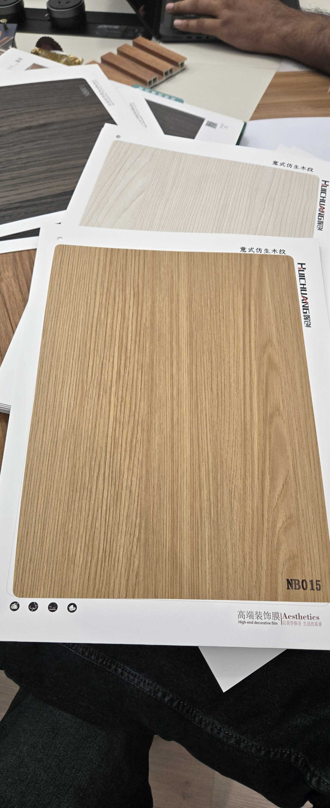

# Huichuang NB015 — Teak (Rift Cut, Light Register)

**7.4 / 10 — Strong Contender** · Target: Teak (*Tectona grandis*) · Cut: Rift cut (light, honey-amber register) · 2026-04-12

---

## Identity
| | |
|---|---|
| Brand | Huichuang (惠创) / Aesthetics |
| Product Code | NB015 |
| Label | 意式仿生木纹 — Italian-style bionic wood grain |
| Target Species | Teak (*Tectona grandis*) — lighter, cleaner colour register |
| Cut Simulated | Rift cut — very clean straight parallel grain, no cathedral |
| Finish | Satin (~10–14% sheen) — well calibrated |
| Pattern Repeat | ~2.5–3.5 m (est.) — rift cut yields long repeat |

---

## Score Breakdown
| | Score | Weight | Contribution |
|---|---|---|---|
| Species Demand (India) | 8.8 / 10 | 40% | 3.52 |
| Mimicry Quality | 6.5 / 10 | 60% | 3.90 |
| **Film Score** | **7.4 / 10** | | |

> Light teak rift cut — cleanest grain execution in the teak series. Tone sits lighter than benchmark golden-amber but the grain geometry is near-perfect. Appeals to contemporary buyers who want teak character without the heavy colour.

---

## Teak Series Positioning — Full Family

| Film | Cut | Tone | Finish | Score |
|---|---|---|---|---|
| NB015 | Rift — light | Honey-amber (light) | ~10–14% | 7.4 |
| NB009+ | Rift — standard | Golden-amber | ~15–20% | 7.5 |
| NB016 | Flat — rich | Deep golden-brown | ~12–15% | 7.5 |
| NB009-1 | Flat — character | Golden-amber | ~15% | 7.4 |

---

## Mimicry Quality — 6.5 / 10

| Dimension | Weight | Score | Note |
|---|---|---|---|
| Tone Accuracy | 15% | 6.5 | Honey-amber — lighter than benchmark teak golden; reads young/sapwood |
| Grain Pattern | 20% | 7.5 | Finest rift grain execution in the teak series — clean and convincing |
| Tonal Variation | 15% | 6.0 | Very uniform — limited light/dark contrast across the grain |
| Heartwood-Sapwood | 10% | 5.5 | Absent — shared gap across teak films |
| Pore / EIR Texture | 15% | 6.5 | Texture present; EIR alignment unconfirmed |
| Finish Level | 15% | 7.0 | ~10–14% — best-calibrated finish in the teak series |
| Depth Illusion | 10% | 6.0 | Limited — very clean grain provides no extra depth cues |

**Best grain quality in the teak family, held back only by the lighter tone.** For buyers who find NB009+ too dark or "heavy," NB015 offers a refined, contemporary teak alternative.

---

## India Market Fit

**Peak segments:** Design Millennials · Aspirational Professionals · Contemporary Indian buyers

**Best cities:** Bengaluru · Pune · Mumbai · Hyderabad

| Application | Fit | Application | Fit |
|---|---|---|---|
| Bedroom Headboard | ✓✓ | Home Office / Study | ✓✓ |
| TV / Media Wall | ✓✓ | Wardrobe Shutters | ✓ |
| Kitchen Cabinets | ✓ | Foyer / Entryway | ✓ |
| Pooja Unit | ~ | Dining Accent Wall | ✓ |

| Design Style | Alignment |
|---|---|
| Contemporary Indian | Very Strong |
| Japandi | Moderate (lighter tone helps) |
| Biophilic / Natural | Strong |
| Heritage / Traditional | Weak (too light for heritage teak buyers) |
| Neo-Classical | Weak |

---

## Gap to Top 3 (8.5 threshold)
**Gap: 1.1 points.** Demand (8.8) is fully there — tone accuracy (6.5 → 7.5) is the primary lever.

Priority improvements:
1. **Tone deepening** — shift 15–20% warmer/deeper toward golden-amber; closes 0.8 mimicry points
2. **Heartwood-sapwood band** — cream-to-amber transition at edge adds 0.5 mimicry points
3. **EIR confirmation** — raking-light test to verify pore channel alignment

---

## Verdict

**Sell here:** Contemporary and transitional residential — bedrooms, home offices, media walls in Bengaluru, Pune, Mumbai. Strong where a buyer wants teak without the heavy traditional look.

**Don't use for:** Heritage buyers, pooja units, Tier-2 markets where deep rich teak is expected.

**Priority fix:** Deepen the tone. The grain is the best in the teak series — this film has the geometry to be a top performer but needs the colour to match.

**Core insight:** NB015 is the contemporary teak — lighter, cleaner, more modern. Pair with NB009+ for a complete teak offering: NB009+ for traditional briefs, NB015 for contemporary ones. The finish calibration is already better than NB009+ — this film is closer to market-ready than its score suggests.
