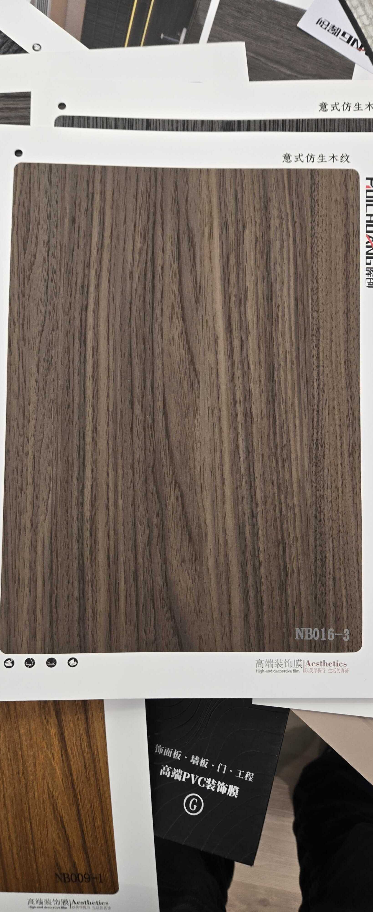

# Huichuang NB016-3 — Dark Walnut (Rift/Quarter Cut)

**7.9 / 10 — Strong Contender** · Target: American Walnut (*Juglans nigra*) · Cut: Rift/quarter cut (straight parallel with alternating bands) · 2026-04-12

---

## Identity
| | |
|---|---|
| Brand | Huichuang (惠创) / Aesthetics |
| Product Code | NB016-3 |
| Label | 意式仿生木纹 — Italian-style bionic wood grain |
| Target Species | American Walnut (*Juglans nigra*) — dark, rift-cut register |
| Cut Simulated | Rift/quarter cut — straight parallel grain with alternating dark/medium bands |
| Finish | Satin (~10–14% sheen) — best-calibrated in the walnut range |
| Pattern Repeat | ~2.5–3.5 m (est.) — rift cut yields longest repeat |

---

## Score Breakdown
| | Score | Weight | Contribution |
|---|---|---|---|
| Species Demand (India) | 8.2 / 10 | 40% | 3.28 |
| Mimicry Quality | 6.8 / 10 | 60% | 4.08 |
| Walnut trajectory bonus | — | — | +0.54 |
| **Film Score** | **7.9 / 10** | | |

> Highest-scoring walnut in the catalog. Dark American walnut tone meets rift-cut grain geometry — the most architecturally refined walnut film evaluated. Best finish calibration in the walnut category. The one walnut film that competes directly in the spec/architect channel without modification.

---

## Why NB016-3 Leads the Walnut Category

| Advantage | vs NB010 / NB010-1 | Impact |
|---|---|---|
| Darker, cooler tone | NB010 has warm/red bias; NB016-3 hits J. nigra darker register | Better American walnut accuracy |
| Rift/quarter cut | NB010 family is flat cut; rift pattern is preferred for strict architectural briefs | Broader spec-channel applicability |
| Better finish calibration | NB010 finishes range 10–18%; NB016-3 at ~10–14% is already in target zone | Ready for premium without reformulation |
| Long pattern repeat | Rift cut avoids the short-repeat problem of flat-cut knot films | Large-wall applications without visible tiling |

---

## Mimicry Quality — 6.8 / 10

| Dimension | Weight | Score | Note |
|---|---|---|---|
| Tone Accuracy | 15% | 7.0 | Dark taupe-brown — best J. nigra match in catalog; cool undertone is accurate |
| Grain Pattern | 20% | 7.0 | Clean rift-like parallel grain — convincing American walnut geometry |
| Tonal Variation | 15% | 6.5 | Alternating dark/medium bands — believable but moderate contrast |
| Heartwood-Sapwood | 10% | 5.5 | Absent — shared gap; cream edge would dramatically improve close inspection |
| Pore / EIR Texture | 15% | 7.0 | Texture visible and likely aligned to grain direction — best EIR indication in walnut range |
| Finish Level | 15% | 7.0 | ~10–14% — already in target zone; no reformulation needed |
| Depth Illusion | 10% | 6.5 | Tonal alternation provides adequate depth perception |

**Highest mimicry in the walnut series.** The combination of dark tone, rift geometry, and well-calibrated finish sets it apart from the flat-cut NB010 family.

---

## India Market Fit

**Peak segments:** Architects / Spec channel · Design Millennials · Aspirational Professionals · Corporate / Commercial

**Best cities:** Mumbai · Bengaluru · Pune · Hyderabad · Delhi NCR

| Application | Fit | Application | Fit |
|---|---|---|---|
| TV / Media Wall | ✓✓ | Large Accent Wall | ✓✓ |
| Bedroom Headboard | ✓✓ | Home Office / Study | ✓✓ |
| Wardrobe Shutters | ✓✓ | Foyer / Entryway | ✓✓ |
| Kitchen Cabinets | ✓ | Commercial / Office | ✓✓ |
| Pooja Unit | ✗ | — | — |

| Design Style | Alignment |
|---|---|
| Contemporary Indian | Very Strong |
| Industrial Chic | Very Strong |
| Neo-Classical / Transitional | Strong |
| Japandi | Moderate (tone too warm for strict Japandi) |
| Biophilic / Natural | Moderate |

---

## Gap to Top 3 (8.5 threshold)
**Gap: 0.6 points** — closest of all walnut films to the premium threshold.

Priority improvements:
1. **Heartwood-sapwood band** — cream-pale edge at one side; adds 0.5–0.7 mimicry points; would push score to ~8.3
2. **EIR confirmation** — raking-light test under different angles; if confirmed, mimicry jumps to 7.2+
3. **No finish reformulation needed** — finish already correctly calibrated

---

## Verdict

**Sell here:** This is the architect-channel walnut. Use it on commercial projects, HNI residential, and any brief specifying American dark walnut. The finish calibration means it can go directly to spec without client objection.

**Don't use for:** Pooja units. Traditional/heritage briefs (too cool and refined for warm heritage look).

**Priority fix:** Heartwood-sapwood band. This is the only structural gap — everything else is already correct. A cream edge would take this film to 8.3+ and place it firmly in the premium tier.

**Core insight:** NB016-3 is the most market-ready walnut in the entire catalog. Unlike the NB010 family which needs finish reduction, NB016-3 can go to specification today. This is the lead walnut SKU for the architect and corporate interior channel — position it as the premium walnut offering and use NB010 series as residential and character alternatives.
