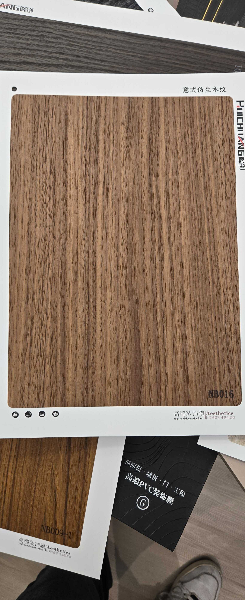

# Huichuang NB016 — Teak (Flat Cut, Rich)

**7.5 / 10 — Strong Contender** · Target: Teak (*Tectona grandis*) · Cut: Flat cut (rich, confident grain) · 2026-04-12

---

## Identity
| | |
|---|---|
| Brand | Huichuang (惠创) / Aesthetics |
| Product Code | NB016 |
| Label | 意式仿生木纹 — Italian-style bionic wood grain |
| Target Species | Teak (*Tectona grandis*) — deeper, richer colour interpretation |
| Cut Simulated | Flat cut — confident parallel grain with natural tonal variation |
| Finish | Satin (~12–15% sheen) — better calibrated than NB009-1 |
| Pattern Repeat | ~2.0–2.8 m (est.) — parallel grain allows good repeat |

---

## Score Breakdown
| | Score | Weight | Contribution |
|---|---|---|---|
| Species Demand (India) | 8.8 / 10 | 40% | 3.52 |
| Mimicry Quality | 6.7 / 10 | 60% | 4.02 |
| **Film Score** | **7.5 / 10** | | |

> Richest teak interpretation in the catalog. Deeper golden-brown captures mature heartwood teak — the colour that premium Indian buyers associate with "real teak."

---

## Teak Series Positioning — Full Family

| Film | Cut | Tone Depth | Best Use | Score |
|---|---|---|---|---|
| NB009+ | Rift | Golden-amber | Architectural / spec channel | 7.5 |
| NB016 | Flat — rich | Deep golden-brown | Premium residential, Tier-1 | 7.5 |
| NB009-1 | Flat — character | Golden-amber | Traditional / heritage | 7.4 |

---

## Mimicry Quality — 6.7 / 10

| Dimension | Weight | Score | Note |
|---|---|---|---|
| Tone Accuracy | 15% | 7.0 | Deep golden-brown — richer than benchmark but resonates with Indian preference |
| Grain Pattern | 20% | 7.0 | Confident parallel grain with natural variation — convincing flat-cut teak |
| Tonal Variation | 15% | 7.0 | Best tonal contrast in teak series — darker streaks against warm base |
| Heartwood-Sapwood | 10% | 5.5 | Absent — shared gap |
| Pore / EIR Texture | 15% | 6.5 | Visible texture suggesting EIR; better than NB009-1 |
| Finish Level | 15% | 6.5 | ~12–15% — closer to target than NB009-1; reduce to 8–12% |
| Depth Illusion | 10% | 6.5 | Tonal contrast does the depth work |

**Highest mimicry score in the teak series (tied with NB009+).** Better tonal contrast and finish calibration than NB009-1. Different aesthetic from NB009+ (richness vs cleanliness).

---

## India Market Fit

**Peak segments:** Heritage Buyers · Aspirational Professionals · Tier-1 premium residential

**Best cities:** Chennai · Ahmedabad · Delhi NCR · Hyderabad · Mumbai · All Tier-2

| Application | Fit | Application | Fit |
|---|---|---|---|
| TV / Media Wall | ✓✓ | Bedroom Headboard | ✓✓ |
| Wardrobe Shutters | ✓✓ | Pooja Unit | ✓✓ |
| Foyer / Entryway | ✓✓ | Dining Accent Wall | ✓ |
| Kitchen Cabinets | ~ | Home Office | ✓ |

| Design Style | Alignment |
|---|---|
| Contemporary Indian | Strong |
| Heritage / Traditional | Very Strong |
| Neo-Classical | Strong |
| Biophilic / Natural | Moderate |
| Japandi | Weak |

---

## Gap to Top 3 (8.5 threshold)
**Gap: 1.0 points.** Demand (8.8) is already there — mimicry (6.7 → 7.5+) is the only barrier.

Priority improvements:
1. **Finish reduction** — 12–15% → 8–10% satin; unlocks premium spec channel
2. **Heartwood-sapwood band** — pale cream edge dramatically improves close-inspection test
3. **EIR confirmation** — raking-light test to verify pore alignment

---

## Verdict

**Sell here:** Everywhere teak is requested at the premium tier — this is the richest, most mature teak colour in the catalog. Particularly strong in Chennai, Ahmedabad, Delhi NCR, Mumbai HNI residential.

**Don't use for:** Japandi briefs, modern minimal, clinical applications.

**Priority fix:** Reduce finish to 8–10%. The depth of colour is a commercial asset — this is the teak film that looks most like the expensive stuff. Don't let a correctable finish hold it out of premium projects.

**Core insight:** NB016 is the premium positioning option in the teak family. The deeper colour reads as more expensive, more authentic, more "real teak" to the Indian buyer. Pair it with NB009+ for a two-SKU teak offering: NB009+ for spec-channel and modern briefs, NB016 for premium residential and traditional briefs.
