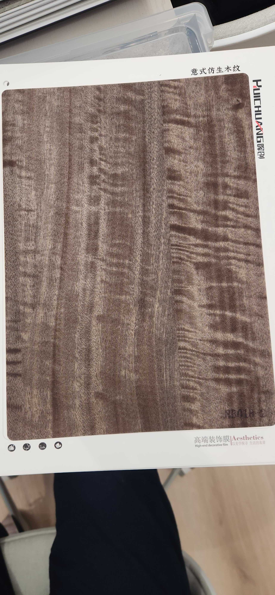

# Huichuang NB018-1 — Figured Hardwood (Fiddle-back, Dark)

**6.4 / 10 — Niche** · Target: Dark Figured / Fiddle-back Hardwood · Cut: Figured flat cut (intense horizontal fiddle-back) · 2026-04-12

---

## Identity
| | |
|---|---|
| Brand | Huichuang (惠创) / Aesthetics |
| Product Code | NB018-1 |
| Label | 意式仿生木纹 — Italian-style bionic wood grain |
| Target Species | Dark Figured Hardwood — fiddle-back / curly figure, taupe-gray-brown |
| Cut Simulated | Figured flat cut — intense horizontal ripple/wave bands |
| Finish | Satin (~12–16% sheen) — reduce to unlock figure drama |
| Pattern Repeat | ~0.6–1.0 m (est.) — tight repeat due to horizontal figure density |

---

## Score Breakdown
| | Score | Weight | Contribution |
|---|---|---|---|
| Species Demand (India) | 5.0 / 10 | 40% | 2.00 |
| Mimicry Quality | 7.3 / 10 | 60% | 4.38 |
| **Film Score** | **6.4 / 10** | | |

> The most technically impressive grain execution in the entire catalog. The fiddle-back figure is dense, consistent, and dramatically lit — the horizontal ripple creates a genuine chatoyance illusion. Score is suppressed by niche India demand for this pattern, not by quality.

---

## NB018 Figured Family Comparison

| Film | Tone | Figure | Depth Illusion | Score |
|---|---|---|---|---|
| NB018-1 | Dark taupe-gray-brown | Dense fiddle-back | ★★★★★ | 6.4 |
| NB018-3 | Warm golden-amber | Curly/wave | ★★★★☆ | 6.3 |
| NB018 | Cream-blonde | Subtle flat/ripple | ★★☆☆☆ | 5.8 |

---

## Mimicry Quality — 7.3 / 10

| Dimension | Weight | Score | Note |
|---|---|---|---|
| Tone Accuracy | 15% | 7.0 | Dark taupe-gray-brown — cool undertone; accurate for dark curly maple / dark figured hardwood |
| Grain Pattern | 20% | 8.0 | Densest, most consistent fiddle-back in catalog — near-museum-grade execution |
| Tonal Variation | 15% | 7.5 | Strong horizontal light/dark alternation — wave peaks and troughs clearly defined |
| Heartwood-Sapwood | 10% | 5.5 | Absent — not critical for figured species |
| Pore / EIR Texture | 15% | 7.0 | EIR likely aligned to horizontal figure — this deserves raking-light confirmation |
| Finish Level | 15% | 6.5 | ~12–16% — reduce to 6–10% matte; low sheen makes fiddle-back figure breathe |
| Depth Illusion | 10% | 8.0 | Best depth illusion of any film evaluated — horizontal figure creates true pseudo-chatoyance |

**Highest mimicry score in the niche/specialty category and among the best overall in the catalog.** The gap between this film's visual quality and its commercial score is the largest in the evaluation — a genuinely premium execution suppressed by market positioning.

---

## India Market Fit

**Peak segments:** Luxury HNI · Boutique Hospitality · Design-Forward Architects · High-end Commercial

**Best cities:** Mumbai (luxury residential + hospitality) · Delhi NCR (HNI + luxury hotel) · Bengaluru (design-forward commercial)

| Application | Fit | Application | Fit |
|---|---|---|---|
| Feature Accent Panel | ✓✓ | 5-Star Hotel Corridor Panel | ✓✓ |
| Luxury Headboard (focal) | ✓✓ | High-end Commercial Reception | ✓✓ |
| Showroom Display | ✓✓ | Foyer Statement Wall | ✓✓ |
| Large TV Wall | ~ | Wardrobes | ✗ |
| Pooja Unit | ✗ | Heritage / Traditional | ✗ |

| Design Style | Alignment |
|---|---|
| Maximalist Luxury | Very Strong |
| Contemporary Indian (luxury tier) | Moderate |
| Industrial Chic | Moderate |
| Japandi | Weak (too busy) |
| Heritage / Traditional | Weak |

---

## Verdict

**Sell here:** Luxury feature applications — hotel lobbies, HNI residence foyers, high-end boutique commercial. The cool dark tone makes it more versatile than NB018-3 for contemporary luxury and hospitality briefs. Pair with dark walnut (NB016-3) or matte black accents.

**Don't use for:** Volume residential, traditional briefs, large continuous surfaces (repeat too short).

**Priority fix:** Reduce finish to 6–10% matte immediately. The fiddle-back figure intensifies dramatically at lower sheen — this is the highest-leverage action for an already outstanding film.

**Core insight:** NB018-1 and NB018-3 are complementary closing tools — NB018-3 for warm luxury briefs (teak-tone, heritage-adjacent), NB018-1 for cool luxury briefs (dark, contemporary, hospitality-grade). Stock both; use them as the pair that makes your showroom memorable. Together they represent the highest grain drama of the 21-film catalog.
