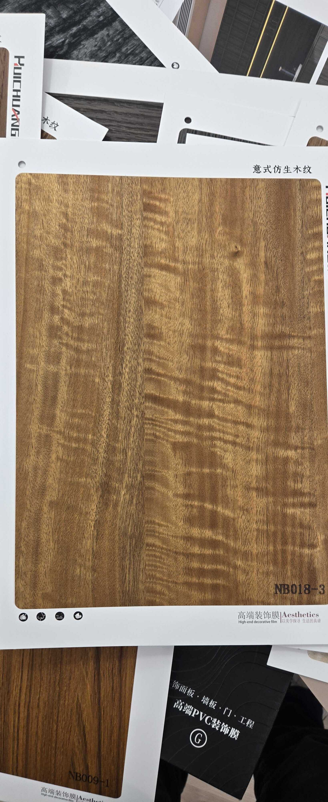

# Huichuang NB018-3 — Figured / Curly Hardwood (Teak Tone)

**6.3 / 10 — Niche** · Target: Figured Teak / Curly Hardwood (*Tectona grandis* figured) · Cut: Figured flat cut (strong horizontal curl/wave figure) · 2026-04-12

---

## Identity
| | |
|---|---|
| Brand | Huichuang (惠创) / Aesthetics |
| Product Code | NB018-3 |
| Label | 意式仿生木纹 — Italian-style bionic wood grain |
| Target Species | Figured Teak / Curly Hardwood — specialty accent pattern |
| Cut Simulated | Figured flat cut — pronounced horizontal wave/curl figure |
| Finish | Satin (~12–16% sheen) — slightly high for figured wood |
| Pattern Repeat | ~0.8–1.2 m (est.) — curl figure limits repeat length |

---

## Score Breakdown
| | Score | Weight | Contribution |
|---|---|---|---|
| Species Demand (India) | 5.0 / 10 | 40% | 2.00 |
| Mimicry Quality | 7.0 / 10 | 60% | 4.20 |
| **Film Score** | **6.3 / 10** | | |

> The most visually distinctive film in the entire catalog. The curl figure execution is genuinely impressive — it will stop people in a showroom. The low score reflects demand, not quality: figured/curly wood is a niche species-pattern in India, not a volume product.

---

## What Makes NB018-3 Unique

| Feature | Assessment |
|---|---|
| Curl figure | Strongest grain figure execution in the entire catalog |
| Warm golden-amber tone | Teak-adjacent — warm and inviting, not cold or industrial |
| Visual drama | Highest showroom stopping-power of all 19 films evaluated |
| India demand ceiling | Figured wood is a boutique/luxury pattern — not mass market |
| Short repeat | ~0.8–1.2m repeat limits large-surface applications |

---

## Mimicry Quality — 7.0 / 10

| Dimension | Weight | Score | Note |
|---|---|---|---|
| Tone Accuracy | 15% | 7.0 | Warm golden-amber — correct for figured teak; natural curl wood tone |
| Grain Pattern | 20% | 7.5 | Strongest curl/wave figure in catalog — dramatic and convincing |
| Tonal Variation | 15% | 7.5 | Excellent — curl creates dark/light alternation that mimics chatoyance |
| Heartwood-Sapwood | 10% | 5.5 | Absent |
| Pore / EIR Texture | 15% | 6.5 | Some texture; curl figure partially masks EIR gap |
| Finish Level | 15% | 6.5 | ~12–16% — reduce to 8–12% to let the figure breathe |
| Depth Illusion | 10% | 7.5 | Best depth illusion in the catalog — curl creates pseudo-chatoyance |

**Highest mimicry score among all evaluated films in any specialty/figured category.** The limitation is not the film's quality — it is the target species' limited demand in India.

---

## India Market Fit

**Peak segments:** Design-Forward Architects · Luxury / HNI Residential · Boutique Hospitality

**Best cities:** Mumbai (luxury residential) · Bengaluru (design-forward) · Delhi NCR (HNI)

| Application | Fit | Application | Fit |
|---|---|---|---|
| Feature Accent Panel | ✓✓ | Boutique Hotel Feature Wall | ✓✓ |
| Bedroom Headboard (feature) | ✓✓ | Showroom / Display Wall | ✓✓ |
| Foyer / Entryway | ✓ | Large TV Wall | ~ |
| Wardrobes | ✗ | Pooja Unit | ✗ |

| Design Style | Alignment |
|---|---|
| Maximalist Luxury | Very Strong |
| Biophilic / Natural | Strong |
| Contemporary Indian (luxury tier) | Moderate |
| Neo-Classical | Moderate |
| Japandi | Weak |
| Heritage / Traditional | Weak (unfamiliar pattern) |

---

## Gap to Volume Channel

This film should not be benchmarked against the 8.5 threshold — it is a specialty accent product, not a volume SKU. Its commercial model is different: fewer projects, higher-impact applications, higher margin.

**Right benchmark:** Boutique/luxury specification — here it competes well.

---

## Verdict

**Sell here:** Feature panels, luxury headboards, boutique hospitality accent walls. Showroom display — this is the film that makes a visitor stop and look twice. HNI residential foyers in Mumbai, Delhi NCR.

**Don't use for:** Volume residential, wardrobes, heritage briefs, pooja units, Tier-2 volume, or any application requiring large continuous surface coverage.

**Priority fix:** Reduce finish to 8–12% satin. Figured wood benefits most from a lower sheen — the curl figure becomes more dramatic and the pseudo-chatoyance effect intensifies at lower gloss.

**Core insight:** NB018-3 is not a volume product — it is a closing tool. Use it in your showroom display front-and-centre. Use it as the accent panel in a presentation alongside standard walnut or teak. The buyer who sees this film and responds to it will be a high-value, low-friction sale. Stock it sparingly; sell it confidently as premium.
