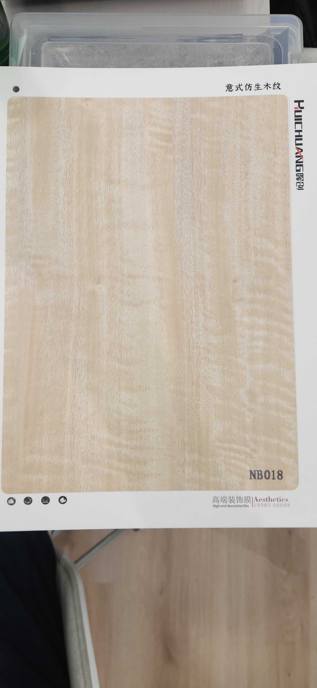

# Huichuang NB018 — Ash (Flat Cut, Light Cream)

**5.8 / 10 — Niche** · Target: European Ash (*Fraxinus excelsior*) · Cut: Flat cut (cream-blonde, subtle grain) · 2026-04-12

---

## Identity
| | |
|---|---|
| Brand | Huichuang (惠创) / Aesthetics |
| Product Code | NB018 |
| Label | 意式仿生木纹 — Italian-style bionic wood grain |
| Target Species | European Ash (*Fraxinus excelsior*) — cream-blonde, very light |
| Cut Simulated | Flat cut — very fine subtle grain with mild ripple figure |
| Finish | Satin (~8–12% sheen) — well calibrated |
| Pattern Repeat | ~2.0–3.0 m (est.) — uniform tone allows long, neutral repeat |

---

## Score Breakdown
| | Score | Weight | Contribution |
|---|---|---|---|
| Species Demand (India) | 4.5 / 10 | 40% | 1.80 |
| Mimicry Quality | 6.7 / 10 | 60% | 4.02 |
| **Film Score** | **5.8 / 10** | | |

> Lightest film in the 21-film catalog. Cream-blonde with very subtle grain — this is the Japandi extreme. Low score reflects honest India demand reality: Ash is a niche species, unknown to most buyers. The mimicry quality is genuinely good — the market ceiling is the constraint.

---

## Light Wood Spectrum — Catalog Positioning

| Film | Tone | Grain | Score |
|---|---|---|---|
| NB018 | Cream-blonde (lightest) | Very subtle flat | 5.8 |
| NB015-1 | Light honey (flat) | Near-straight flat | 7.2 |
| NB015 | Light honey-amber (rift) | Clean rift | 7.4 |
| NB003 | Honey-blonde | Cathedral flat | 7.5 |
| ART DECOR Oak | Honey-blonde | Rift | 7.5 |

---

## Mimicry Quality — 6.7 / 10

| Dimension | Weight | Score | Note |
|---|---|---|---|
| Tone Accuracy | 15% | 7.5 | Cream-blonde — very accurate for European Ash; subtle warm undertone correct |
| Grain Pattern | 20% | 7.0 | Subtle flat grain with mild ripple — correct ash character; fine and even |
| Tonal Variation | 15% | 6.0 | Very uniform — mild variation with slight lighter central zone |
| Heartwood-Sapwood | 10% | 6.0 | Very mild sapwood suggestion visible — ash naturally has limited contrast |
| Pore / EIR Texture | 15% | 6.5 | Fine texture visible; EIR alignment unconfirmed but fits grain scale |
| Finish Level | 15% | 7.5 | ~8–12% — best-calibrated finish in the catalog for light wood applications |
| Depth Illusion | 10% | 6.0 | Very clean — limited depth cues, but ash is naturally flat-looking |

**Best finish calibration in the light wood category.** The grain execution is accurate — ash is genuinely a subtle species and the film respects that. The low score is entirely a demand issue.

---

## India Market Fit

**Peak segments:** Design-Forward Architects · Ultra-modern Japandi · Hospitality (Scandi-style boutique)

**Best cities:** Bengaluru · Pune (design-forward boutique; nowhere else)

| Application | Fit | Application | Fit |
|---|---|---|---|
| Kitchen Cabinet Shutters | ✓✓ | Bedroom (Japandi brief) | ✓✓ |
| Wardrobe Shutters (neutral) | ✓ | Home Office / Study | ✓ |
| Boutique Café / Restaurant | ✓ | Bathroom Vanity | ✓ |
| TV Wall | ~ | Heritage / Traditional | ✗ |
| Pooja Unit | ✗ | Tier-2 residential | ✗ |

| Design Style | Alignment |
|---|---|
| Japandi | Very Strong |
| Biophilic / Natural | Strong |
| Contemporary Indian | Weak (too light for mainstream) |
| Neo-Classical | Very Weak |
| Heritage / Traditional | Very Weak |

---

## The Demand Ceiling Problem

NB018's score is suppressed by species demand, not quality. The film does its job well — it mimics ash accurately. The issue is that Indian buyers predominantly do not request ash. Recovery strategies:

| Strategy | Potential |
|---|---|
| Sell as "White Oak" (reposition) | Moderate — white oak demand higher than ash in India |
| Japandi specification packages | Low volume but high margin |
| Pair with NB016-3 dark walnut | Creates dramatic light-dark contrast; strong design pairing |
| Hospitality / boutique projects | Better fit than residential |

---

## Verdict

**Sell here:** Strictly Japandi briefs in Bengaluru and Pune — kitchens, bedrooms, home offices where the brief specifies the lightest possible wood tone. Boutique hospitality projects with Scandi or Nordic design direction.

**Don't use for:** Heritage buyers, teak/walnut briefs, Tier-2 volume, traditional Indian residential.

**Priority fix:** None structural — the film is well-executed. Consider repositioning under "White Oak" labeling to access the broader oak demand pool (7.2 vs 4.5 demand score).

**Core insight:** NB018 is the portfolio's whitespace occupier — no other film covers this light cream-blonde territory. It will rarely be the right product but when the brief calls for it, nothing else in the catalog comes close. Stock minimally; price at premium. The buyer who needs ash will not settle for honey-blonde teak.
