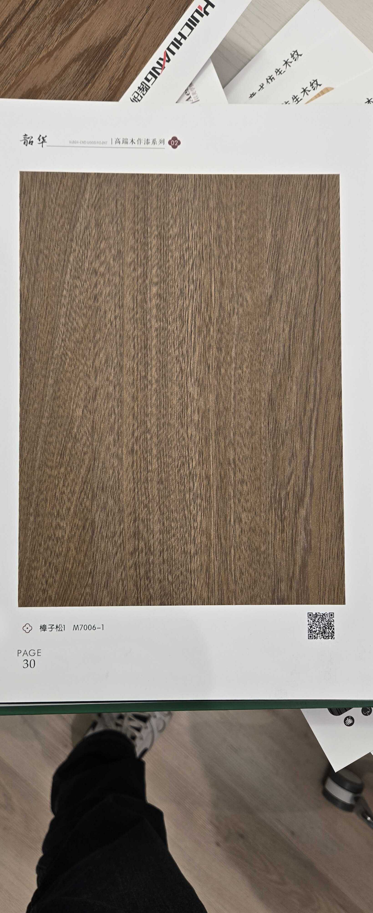

# Shaohua M7006-1 — Mongolian Pine (Flat Cut, Warm Caramel)

**5.4 / 10 — Niche** · Target: Mongolian Scots Pine (*Pinus sylvestris* var. *mongolica*) · Cut: Flat cut — straight fine grain · 2026-04-12

---

## Identity
| | |
|---|---|
| Brand | Shaohua (韶华) — 高端木作漆系列 (High-end Wood Lacquer Series 02) |
| Product Code | M7006-1 |
| Label | 樟子松1 — "Mongolian Pine 1" |
| Target Species | Mongolian Scots Pine (*Pinus sylvestris* var. *mongolica*) — warm stained lacquer |
| Cut Simulated | Flat cut — very straight, fine-line grain |
| Finish | Satin (~15–18% sheen) — lacquer series; appropriate for lacquered pine aesthetic |
| Pattern Repeat | ~3.0–4.0 m (est.) — straight grain allows long repeats before tiling |
| Series Feature | 高端木作漆 (High-end wood lacquer) — premium lacquer finish positioning |

---

## Score Breakdown
| | Score | Weight | Contribution |
|---|---|---|---|
| Species Demand (India) | 3.5 / 10 | 40% | 1.40 |
| Mimicry Quality | 6.6 / 10 | 60% | 3.96 |
| **Film Score** | **5.4 / 10** | | |

> The label is the liability, not the film. M7006-1's warm caramel-brown with clean fine grain is a genuinely appealing visual — it reads as a medium-stained oak or light teak in context. But labelled as Mongolian Pine, it has near-zero demand in India. The highest-leverage action is repositioning: drop the pine identity entirely and sell on visual appeal alone.

---

## Mimicry Quality — 6.6 / 10

| Dimension | Weight | Score | Note |
|---|---|---|---|
| Tone Accuracy | 15% | 7.0 | Warm caramel-brown — accurate for lacquered/stained Mongolian Pine |
| Grain Pattern | 20% | 7.5 | Exceptionally straight, fine flat-cut grain — characteristic pine accuracy |
| Tonal Variation | 15% | 6.5 | Subtle variation; even tone with mild grain line contrast |
| Heartwood-Sapwood | 10% | 5.5 | Limited sapwood contrast — pine naturally has this |
| Pore / EIR Texture | 15% | 6.5 | Tight fine texture consistent with pine character |
| Finish Level | 15% | 6.5 | ~15–18% — appropriate for lacquered pine; would need to drop for oak repositioning |
| Depth Illusion | 10% | 5.5 | Clean and flat — pine is inherently a 2D-looking species |

**The grain execution is clean and accurate.** Straight fine-line flat-cut pine is genuinely difficult to replicate convincingly, and this film does it well. The limitation is structural — the species it accurately mimics has no India demand.

---

## The Repositioning Opportunity

M7006-1 sits in a visual zone shared by three higher-demand species:

| Visual Read | If Positioned As | Demand Score | Repositioned Score |
|---|---|---|---|
| As Mongolian Pine | Pine | 3.5 | 5.4 (current) |
| As Medium Smoked Oak | Smoked Oak | 6.5 | ~6.8 (est.) |
| As Caramel / Light Teak | Light Teak | 8.0 | ~7.9 (est.) |

**The teak repositioning is the highest-upside play.** The warm caramel tone and straight fine grain are not far from light rift-cut teak — a small relabelling exercise could capture a dramatically higher demand pool. The only tell is that teak grain has slightly more pronounced texture; with a finish adjustment (drop to 10–12%) the gap narrows.

---

## India Market Fit

**Peak segments (as pine):** Essentially none — pine has no established demand channel in India's panel market.

**Peak segments (repositioned as 'Caramel Oak' or 'Natural Teak'):** Aspirational Professionals · Design-Forward Millennials · Kitchen Specialists

**Best cities (repositioned):** Bengaluru · Pune · Mumbai (modern kitchens)

| Application | Fit (as Pine) | Fit (Repositioned) |
|---|---|---|
| Kitchen Cabinet Shutters | ✗ | ✓✓ |
| Wardrobe Shutters | ✗ | ✓ |
| Home Office / Study | ✗ | ✓ |
| Bedroom (light brief) | ✗ | ✓ |
| TV Wall | ✗ | ~ |
| Pooja Unit | ✗ | ~ |
| Heritage / Traditional | ✗ | ✗ |

| Design Style | Alignment |
|---|---|
| Japandi | Moderate (warm, but not quite light enough) |
| Contemporary Indian (warm brief) | Moderate |
| Biophilic / Natural | Moderate |
| Neo-Classical | Weak |
| Maximalist Luxury | Very Weak |

---

## Lacquer Series Distinction

M7006-1 is from Shaohua's 高端木作漆系列 (High-end Wood Lacquer Series) — this means the film mimics wood that has received a quality lacquer finish, not raw/open-pore wood. In India:

| Lacquer Positioning | Market Read |
|---|---|
| Matches traditional Indian wood-furniture aesthetics | ✓ — lacquered wood is the norm in Indian kitchens |
| Higher sheen acceptable in kitchen/wardrobe context | ✓ — Indian kitchens typically have 15–25% sheen |
| Conflicts with Japandi/open-pore spec briefs | ✗ — architects spec open-pore matte |

This series positioning actually helps in the kitchen/wardrobe application where buyers expect a finished, lacquered look.

---

## Catalog Context — Light-to-Medium Warm Films

| Film | Tone | Grain | Score |
|---|---|---|---|
| NB015 (Teak Rift) | Light honey-amber | Clean rift | 7.4 |
| NB015-1 (Oak Flat Light) | Light honey | Near-straight flat | 7.2 |
| M7006-1 (Pine / Repositioned) | Warm caramel-brown | Very straight flat | 5.4 |
| NB018 (Ash) | Cream-blonde | Very subtle flat | 5.8 |

M7006-1 occupies a slightly darker, warmer position than NB015-1 — closer to a medium caramel oak tone. If repositioned, it fills a gap between the light honey of NB015-1 and the mid-browns of the walnut range.

---

## Verdict

**Sell here (repositioned):** Kitchen cabinet shutters and wardrobe shutters where a warm caramel medium-tone is specified. Label as "Caramel Oak" or "Natural Wood" — never as pine. Bengaluru and Pune modern residential kitchens.

**Don't use for:** Any brief where the customer is species-aware, heritage buyers, dark-tone applications, or any application requiring Japandi-grade open-pore matte.

**Priority fix (two actions):**
1. Drop the pine label entirely — use "Caramel Oak" or "Warm Natural"
2. Reduce finish to 10–12% if targeting architect/spec briefs; keep 15–18% for kitchen/wardrobe trade channel

**Core insight:** M7006-1 is a victim of labelling, not execution. The film quality is solid — fine straight grain with a warm caramel tone that has genuine market appeal. The pine identity suppresses its score by ~1.4 points relative to what the same visual would achieve as a medium oak. This is the catalog's clearest example of a repositioning fix delivering immediate commercial return. Do not stock as pine. Restock as caramel oak. The film doesn't change — the pitch does.
