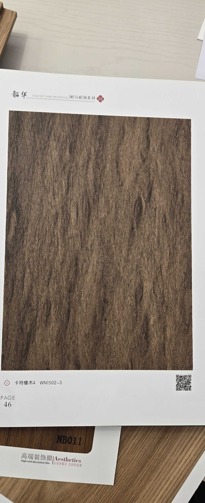

# Shaohua WN1502-3 — Carter Oak (Character Flat, Dark Warm)

**6.6 / 10 — Niche** · Target: Dark / Smoked European Oak (*Quercus robur*, coloured) · Cut: Flat cut — character figure, wavy interlocked grain · 2026-04-12

---

## Identity
| | |
|---|---|
| Brand | Shaohua (韶华) — 耐污耐刮系列 (Stain & Scratch Resistant Series 03) |
| Product Code | WN1502-3 |
| Label | 卡特橡木4 — "Carter Oak 4" |
| Target Species | Dark / Fumed European Oak (*Quercus robur*) — cocoa-brown coloured finish |
| Cut Simulated | Flat cut — strong character figure with wavy, interlocked grain movement |
| Finish | Satin (~15–18% sheen) — functional premium; slightly high for specification oak |
| Pattern Repeat | ~2.5–3.5 m (est.) — character grain means reasonable repeat before obvious tiling |
| Series Feature | 耐污耐刮 (Stain & scratch resistant) — premium coating layer; durability advantage |

---

## Score Breakdown
| | Score | Weight | Contribution |
|---|---|---|---|
| Species Demand (India) | 6.5 / 10 | 40% | 2.60 |
| Mimicry Quality | 6.6 / 10 | 60% | 3.96 |
| **Film Score** | **6.6 / 10** | | |

> Rich dark-warm oak with walnut-adjacent tones. The character grain has genuine visual drama — multiple cocoa-brown tone zones with flowing interlocked movement create an appealing dynamic that bridges the oak and walnut aesthetic. Score suppressed by species positioning: "Carter Oak" is unknown in India and dark smoked oak is still a niche category, despite growing demand in the architect/HNI segment.

---

## Mimicry Quality — 6.6 / 10

| Dimension | Weight | Score | Note |
|---|---|---|---|
| Tone Accuracy | 15% | 7.0 | Cocoa-brown with warm golden streaks — accurate for fumed/smoked European Oak |
| Grain Pattern | 20% | 7.0 | Pronounced wavy, interlocked character grain — convincing flat-cut oak figure |
| Tonal Variation | 15% | 7.0 | Multiple tone zones within grain bands — good light/dark movement |
| Heartwood-Sapwood | 10% | 6.0 | Subtle contrast zones visible; consistent with coloured oak where sapwood is minimal |
| Pore / EIR Texture | 15% | 6.0 | Medium-open oak pore character; EIR alignment unclear from sample — needs physical inspection |
| Finish Level | 15% | 6.0 | ~15–18% satin — functional series has coating priority; ideal oak spec finish is 8–12% |
| Depth Illusion | 10% | 6.5 | Flowing character grain creates good visual depth; stronger than most flat-cut films |

**The character grain execution is this film's asset.** The flowing, wavy interlocked pattern creates a visual interest that most flat-cut oak films lack. The main gap is finish level — reducing to 8–12% would immediately improve specification appeal.

---

## Visual Character — Carter Oak vs Standard Oak

| Attribute | WN1502-3 | Standard Oak Flat | Dark Walnut |
|---|---|---|---|
| Tone | Dark cocoa-brown | Honey-blonde | Chocolate-brown |
| Grain movement | High — wavy, flowing | Low — near-straight | Medium — straight-ish |
| Drama level | ★★★★☆ | ★★☆☆☆ | ★★★☆☆ |
| Walnut overlap | Strong | None | N/A |
| India demand ceiling | Moderate | Low–Moderate | High |

This film sits in an interesting visual middle ground — darker than standard oak, warmer than dark walnut. It can be sold into either category depending on how it's positioned.

---

## India Market Fit

**Peak segments:** Design-Forward Architects · Luxury HNI · Contemporary Commercial

**Best cities:** Mumbai (contemporary luxury) · Bengaluru (spec channel) · Delhi NCR (HNI residential)

| Application | Fit | Application | Fit |
|---|---|---|---|
| TV / Feature Accent Wall | ✓✓ | Luxury Headboard | ✓✓ |
| Home Office / Study | ✓✓ | Foyer Feature Panel | ✓ |
| Wardrobe Shutters | ✓ | Boutique Commercial | ✓ |
| Kitchen Cabinets | ~ | Pooja Unit | ✗ |
| Heritage / Traditional | ✗ | Tier-2 Volume | ✗ |

| Design Style | Alignment |
|---|---|
| Contemporary Indian (dark tones) | Strong |
| Maximalist Luxury | Strong |
| Industrial Chic | Moderate |
| Biophilic / Natural | Moderate |
| Neo-Classical | Weak |
| Japandi | Very Weak (too dark, too busy) |

---

## Stain & Scratch Resistant Series — Durability Edge

WN1502-3 comes from Shaohua's Series 03 (耐污耐刮系列), which means it carries an additional protective coating layer. In India's context:

| Feature | Benefit |
|---|---|
| Stain resistance | Kitchen and dining applications become viable |
| Scratch resistance | Wardrobe and high-traffic surface applications |
| Durability premium | Justifies higher unit pricing in spec channel |
| Positioning | Sell as "Italian-grade performance finish" not just visual |

This functional advantage is undersold. Pair the durability claim with the visual drama and this becomes a stronger commercial proposition.

---

## Positioning Strategies

| Strategy | Potential |
|---|---|
| Sell as "Smoked Oak" | Moderate — smoked oak has growing architect pull |
| Position alongside dark walnut (NB016-3) | High — creates warm vs cool dark pairing |
| Lead with durability (stain/scratch resistant) | High — differentiator in kitchen/wardrobe applications |
| Avoid "Carter Oak" label entirely | Critical — use visual descriptor, not brand name |

---

## Catalog Context — Dark Warm Films

| Film | Tone | Grain | Score |
|---|---|---|---|
| NB016-3 (Dark Walnut Rift) | Deep espresso | Straight rift | 7.9 |
| WN1502-3 (Carter Oak) | Cocoa-brown, warm | Wavy character flat | 6.6 |
| NB018-1 (Figured Dark) | Taupe-gray-brown | Dense fiddle-back | 6.4 |

WN1502-3 fills the "warm dark with grain movement" niche that NB016-3 (cool, linear, architectural) and NB018-1 (cool, horizontal figure) don't cover.

---

## Verdict

**Sell here:** Feature walls, TV walls, and luxury headboards where the brief calls for dark warmth with visual grain interest. Use alongside NB016-3 as a warmer, more dynamic alternative. Lead with the durability story for kitchen and wardrobe applications.

**Don't use for:** Japandi briefs, traditional/heritage buyers, volume residential, or any application requiring light tones.

**Priority fix:** Reduce finish to 8–12% satin. Drop the "Carter Oak" name in favour of "Dark Smoked Oak" or "Character Dark Oak." The durability claim (Series 03) should be front-and-centre in commercial conversations.

**Core insight:** This is a warm-character-dark film in a catalog that already has a cold-linear-dark option (NB016-3). They are genuinely complementary — not duplicates. WN1502-3's wavy flowing grain appeals to buyers who find NB016-3 too austere. Stock it as a secondary dark option; use it to close the buyers who respond to warmth and movement over precision.
