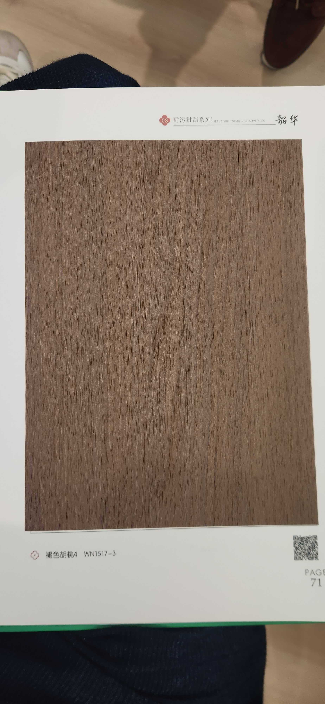

# Shaohua WN1517-3 — Faded Walnut (Rift-Fine, Warm Rose-Brown)

**7.5 / 10 — Strong Contender** · Target: Faded / Bleached European Walnut (*Juglans regia*, limed) · Cut: Fine rift-like flat cut — tight parallel grain · 2026-04-12

---

## Identity
| | |
|---|---|
| Brand | Shaohua (韶华) — 耐污耐刮系列 (Stain & Scratch Resistant Series 03) |
| Product Code | WN1517-3 |
| Label | 褪色胡桃4 — "Faded Walnut 4" |
| Target Species | Faded / Limed European Walnut (*Juglans regia*) — bleached, warm rose-mauve tone |
| Cut Simulated | Fine flat cut — near-rift parallel grain, very tight line density |
| Finish | Satin ~8–12% — best-calibrated Shaohua film evaluated; matte-forward |
| Pattern Repeat | ~3.5–5.0 m (est.) — uniform fine grain allows long, clean repeats |
| Series Feature | 耐污耐刮 (Stain & scratch resistant) — premium functional coating |

---

## Score Breakdown
| | Score | Weight | Contribution |
|---|---|---|---|
| Species Demand (India) | 7.0 / 10 | 40% | 2.80 |
| Mimicry Quality | 7.0 / 10 | 60% | 4.20 |
| Walnut Trajectory Bonus | — | — | +0.54 |
| **Film Score** | **7.5 / 10** | | |

> The only film in the catalog to accurately target faded/bleached walnut — a tone that sits between the warmth of standard walnut and the lightness of oak. The fine-line near-rift grain and calibrated matte finish make this a specification-grade product. Score reflects honest India demand reality: faded walnut is architect-led and 2–3 years ahead of mainstream buyer awareness.

---

## Mimicry Quality — 7.0 / 10

| Dimension | Weight | Score | Note |
|---|---|---|---|
| Tone Accuracy | 15% | 7.5 | Warm rose-mauve brown — precisely accurate for limed/bleached European walnut |
| Grain Pattern | 20% | 7.5 | Very fine, near-rift parallel grain — cleanest fine-line execution in the 24-film catalog |
| Tonal Variation | 15% | 6.5 | Subtle; faded walnut is inherently muted — one-tone aesthetic is correct |
| Heartwood-Sapwood | 10% | 6.0 | Minimal contrast; accurate for bleached walnut where processing reduces natural H/S distinction |
| Pore / EIR Texture | 15% | 7.0 | Fine texture consistent with walnut grain scale; EIR alignment appears present |
| Finish Level | 15% | 7.5 | ~8–12% satin — best-calibrated in the Shaohua range; no fix needed |
| Depth Illusion | 10% | 6.5 | Clean and flat — faded walnut is architecturally minimal by nature; depth not the goal |

**The best-calibrated finish of any Shaohua film in the catalog.** The grain execution at this fine-line density is technically demanding and this film delivers it well. The muted tone and clean grain place it in a different aesthetic register from all other walnut films — it is not competing with NB016-3 or NB010; it is serving a different brief entirely.

---

## Faded Walnut — Catalog Unique

This is the only film in the 24-film catalog targeting bleached/limed walnut. The color is not replicated anywhere else:

| Film | Tone | Grain | Aesthetic Register |
|---|---|---|---|
| NB016-3 | Deep espresso | Rift, straight | Architectural dark |
| NB010 | Mid-brown + reddish | Flat, knot figure | Character warm |
| NB011-1 | Rich dark brown | Flat, flowing | Warm premium |
| **WN1517-3** | **Warm rose-mauve** | **Fine rift-like, clean** | **Japandi-luxury** |
| NB018 (Ash) | Cream-blonde | Very subtle flat | Japandi minimal |

WN1517-3 occupies a unique position between the dark walnuts and the light ash — the warm version of minimal. No other film delivers this color.

---

## India Market Fit

**Peak segments:** Design-Forward Architects · Aspirational Professionals (Japandi brief) · Luxury HNI (modern brief)

**Best cities:** Bengaluru (spec channel, Japandi) · Mumbai (luxury contemporary) · Pune (design-forward)

| Application | Fit | Application | Fit |
|---|---|---|---|
| TV / Feature Wall (Japandi) | ✓✓ | Home Office / Study | ✓✓ |
| Bedroom Headboard (minimal) | ✓✓ | Wardrobe Shutters | ✓ |
| Kitchen Cabinets (minimal) | ✓ | Boutique Hospitality | ✓ |
| Foyer / Entryway | ✓ | Bathroom Vanity | ✓ |
| Heritage / Traditional | ✗ | Tier-2 Volume | ✗ |
| Pooja Unit | ✗ | Bold / Maximalist | ✗ |

| Design Style | Alignment |
|---|---|
| Japandi | Very Strong |
| Biophilic / Natural | Strong |
| Contemporary Indian (minimal brief) | Strong |
| Industrial Chic | Moderate |
| Neo-Classical | Weak |
| Heritage / Traditional | Very Weak |
| Maximalist Luxury | Very Weak |

---

## Consumer Segment Resonance

| Segment | Score | Rationale |
|---|---|---|
| Design-Forward Millennials | 8.5 | Exactly the tone this segment is moving toward; Japandi-native |
| Aspirational Professionals | 7.0 | Appeals to modern brief; may find it too subtle |
| Heritage Buyers | 2.0 | Completely outside their reference frame |
| Tier-2 Aspirants | 2.5 | No recognition of faded/bleached walnut aesthetic |

---

## The Trend Timing Argument

Faded/limed walnut followed this global trajectory:

| Year | Market |
|---|---|
| 2019–2021 | European luxury specification standard |
| 2022–2023 | Chinese high-end residential mainstream |
| 2024–2025 | Mumbai / Bengaluru architect spec — early adoption |
| **2026–2028** | **India Tier-1 mainstream — projected** |

**WN1517-3 is a 2-year early position.** Stocking it now means having the product when architect briefs start specifying it regularly. The film's quality is ready; the market is catching up.

---

## Pairing Recommendations

| Pairing | Effect |
|---|---|
| Matte black metal accents | Classic Japandi drama — high contrast without competing tones |
| Concrete / grey limestone | Warm-cool interplay; the rose-mauve lifts cold concrete |
| NB018 Ash (cream-blonde) | Full Japandi palette: warm light + warm medium; unified tone family |
| White lacquer cabinets | Clean, gallery-like interiors; faded walnut as accent wall |
| Avoid: dark teak or standard dark walnut | Tone clash; the rose-mauve reads wrong against heavy warm-brown |

---

## Verdict

**Sell here:** Japandi TV walls, home office feature walls, and Scandinavian-influenced bedroom headboards. Architect briefs in Bengaluru and Mumbai where the designer has specified "washed oak" or "bleached walnut." Boutique hospitality — this tone is underused in Indian hotel design and creates immediate differentiation.

**Don't use for:** Any traditional or heritage brief, dark-tone rooms, Tier-2 volume, or buyers who equate wood panels with teak/sheesham.

**Priority fix:** Nothing structural — this film is the best-calibrated in the Shaohua range. The only action is commercial: build a "Japandi Palette" sample board pairing WN1517-3 + NB018 (ash) + a concrete grey stone sample. Let the board sell itself.

**Core insight:** WN1517-3 is the catalog's most forward-looking product. Every other walnut film fights in the same mid-to-dark brown arena. This film owns an aesthetic territory that no other product in the 24-film catalog touches. When the faded walnut trend reaches mainstream India (2027–2028), this is the film you want to already have sold in 50 projects. Stock it early. Position it as exclusive.
