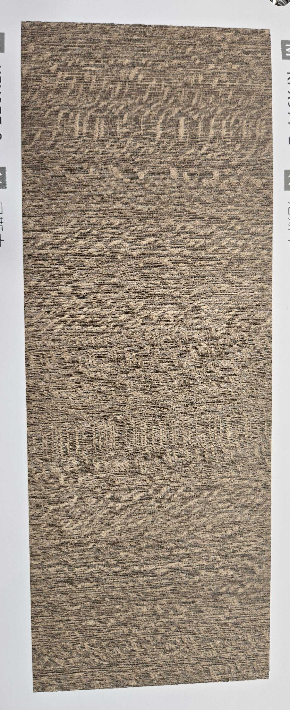

# WiseWood Lacewood Quarter Cut — Film Analysis

**4.7 / 10 — Low Priority** · Target: Lacewood / Silky Oak (*Grevillea robusta*) · Cut: Quarter cut (medullary ray fleck) · 2026-04-12

---

## Identity
| | |
|---|---|
| Brand | WiseWood |
| Target Species | Lacewood / Silky Oak (*Grevillea robusta*) |
| Cut Simulated | Quarter cut — medullary ray fleck pattern |
| Finish | Soft satin (~10–15% sheen) — appropriate |
| Pattern Repeat | ~1.2–1.8 m (est.) |

---

## Score Breakdown
| | Score | Weight | Contribution |
|---|---|---|---|
| Species Demand (India) | 3.8 / 10 | 40% | 1.52 |
| Mimicry Quality | 4.3 / 10 | 60% | 2.58 |
| Japandi adjacency | — | — | +0.60 |
| **Film Score** | **4.7 / 10** | | |

> Doubly handicapped: low species demand + the species' defining property (chatoyance) is physically impossible to replicate in flat film.

---

## Mimicry Quality — 4.3 / 10

| Dimension | Weight | Score | Note |
|---|---|---|---|
| Tone Accuracy | 15% | 5.5 | Warm-pink direction correct; oversaturated, missing silver register |
| Fleck Pattern Fidelity | 25% | 4.5 | Organic and chaotic — better than expected; but reads as "heavy grain" not "fleck" |
| **Chatoyance** | **25%** | **0.0** | **Physically impossible in flat film — structural ceiling, not a manufacturing flaw** |
| Tonal Variation / Depth | 15% | 4.5 | Flat fleck zones; no internal gradient |
| Pore / EIR Texture | 10% | 4.0 | Uniform over fleck zones — missed EIR zoning opportunity |
| Finish Level | 10% | 6.5 | Satin — appropriate |

**The Chatoyance Tax:** Every lacewood film carries a ~2.5–3.0 point penalty because chatoyance — the shimmer-and-shift light-play as you move — is the entire identity of the species and cannot exist in a static flat substrate. No manufacturer can fix this without metallic/holographic ink on fleck zones.

---

## India Market Fit

**Peak segment:** Design-forward millennials (25–35, Bengaluru/Pune) — the only segment that might actively request this pattern.

**Best cities:** Bengaluru · Pune (Japandi / biophilic briefs only)

| Application | Fit | Application | Fit |
|---|---|---|---|
| Bedroom Headboard | ✓ | TV / Media Wall | ~ |
| Home Office / Study | ✓ | Foyer / Entryway | ~ |
| Kitchen Cabinets | ✗ | Pooja Unit | ✗ |

| Design Style | Alignment |
|---|---|
| Japandi | Moderate |
| Biophilic / Natural | Moderate |
| Contemporary Indian | Weak |
| Everything else | Weak |

---

## Verdict

**Sell here:** High-specification designer-led projects only. Bedroom headboards and home office panels in Bengaluru/Pune boutique residential. Boutique hospitality. Conversation-piece accent applications.

**Never use for:** Mass-market carpentry, Tier-2 projects, kitchens, pooja units, or any application with directional lighting (raking light exposes the static fleck immediately).

**The honest recommendation:** Anyone who wants the Silky Oak aesthetic should be pointed to the real veneer. Anyone who wants the general Lacewood palette (light, patterned, organic) without chatoyance is better served by ash or white oak films — which achieve the same design intent with higher demand and better mimicry.

**Improvement ceiling:** Even with metallic fleck inks and zoned EIR emboss, the best achievable score is ~5.5. India demand (3.8) cannot be improved through film development — it's a market education problem, not a product problem.
