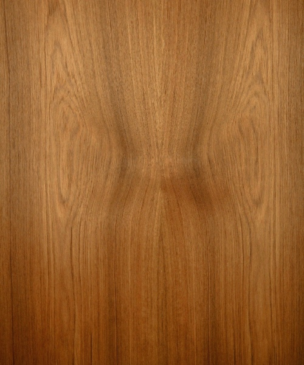

# WiseWood Teak Flat Cut — Film Analysis

**7.3 / 10 — Strong Contender** · Target: Teak (*Tectona grandis*) · Cut: Flat cut (mild cathedral) · 2026-04-12

---

## Identity
| | |
|---|---|
| Brand | WiseWood |
| Target Species | Teak (*Tectona grandis*) |
| Cut Simulated | Flat cut — mild cathedral figure |
| Finish | Satin (~8–15% sheen) — correctly specified |
| Pattern Repeat | ~1.8–2.5 m (est.) |

---

## Score Breakdown
| | Score | Weight | Contribution |
|---|---|---|---|
| Species Demand (India) | 8.8 / 10 | 40% | 3.52 |
| Mimicry Quality | 6.4 / 10 | 60% | 3.84 |
| **Film Score** | **7.3 / 10** | | |

> Teak is India's highest-volume species. This film has the highest demand score in the catalog (8.8) — carried by species prestige alone.

---

## Mimicry Quality — 6.4 / 10

| Dimension | Weight | Score | Note |
|---|---|---|---|
| Tone Accuracy | 15% | 6.5 | Golden-mid-brown correct; slightly warm but within range |
| Grain Pattern | 20% | 6.5 | Cathedral figure present; mild and naturalistic |
| Tonal Variation | 15% | 6.5 | Adequate variation along length |
| Heartwood-Sapwood | 10% | 5.5 | Absent — significant missed feature for teak identification |
| Pore / EIR Texture | 15% | 6.0 | EIR unconfirmed; medium emboss present |
| Finish Level | 15% | 7.0 | Satin — correctly specified |
| Depth Illusion | 10% | 6.0 | Acceptable for flat film |

**Critical gap:** Real teak has a distinctive golden oiliness and prominent heartwood-sapwood contrast. Neither is captured. A trained eye identifies this as film at close inspection.

---

## India Market Fit

**Peak segments:** Heritage buyers (45+, HNI) · Aspirational professionals · Tier-2 aspirants — broadest cross-segment appeal in catalog.

**Best cities:** Chennai · Ahmedabad · Delhi NCR · Hyderabad · All Tier-2

| Application | Fit | Application | Fit |
|---|---|---|---|
| TV / Media Wall | ✓✓ | Wardrobe Shutters | ✓ |
| Bedroom Headboard | ✓✓ | Kitchen Cabinets | ~ |
| Dining Accent Wall | ✓ | Pooja Unit | ✓ |
| Foyer / Entryway | ✓ | Home Office | ✓ |

| Design Style | Alignment |
|---|---|
| Contemporary Indian | Strong |
| Neo-Classical / Transitional | Strong |
| Heritage / Traditional | Strong |
| Biophilic / Natural | Moderate |
| Japandi | Weak |

---

## Gap to Top 3 (8.5 threshold)
**Gap: 1.2 points.** Demand (8.8) already clears the threshold — bottleneck is mimicry (6.4). Mimicry to 7.5+ → Film Score to 8.5+.

Priority improvements:
1. **Heartwood-sapwood contrast** — add cream-pale sapwood band at one edge
2. **EIR pore upgrade** — deepen vessel channel emboss to match teak's ring-porous structure
3. **Tonal depth** — expand lighter and darker cloud zones for organic variation

---

## Verdict

**Sell here:** Everywhere. Broadest applicability in the catalog. Teak's name does the selling across all segments and cities. Especially strong in Chennai, Ahmedabad, Delhi NCR, all Tier-2.

**Don't use for:** Strict Japandi briefs, maximalist dark interiors.

**Priority fix:** Add heartwood-sapwood contrast to the print design. A pale cream zone at one panel edge makes the film instantly more convincing to teak-familiar buyers.

**Core insight:** This film sits at #3 despite having the highest demand score (8.8) because mimicry quality (6.4) is limiting. A premium teak film with proper EIR and sapwood contrast is the single most commercially valuable product improvement opportunity in this catalog.
